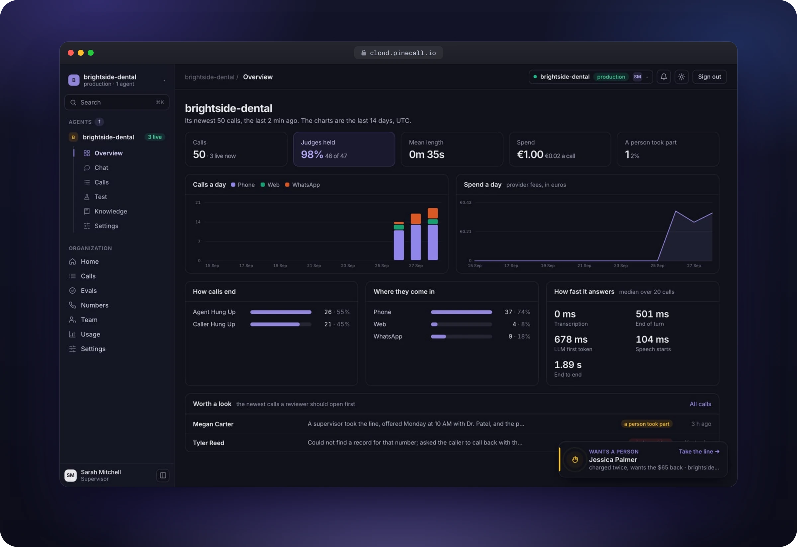
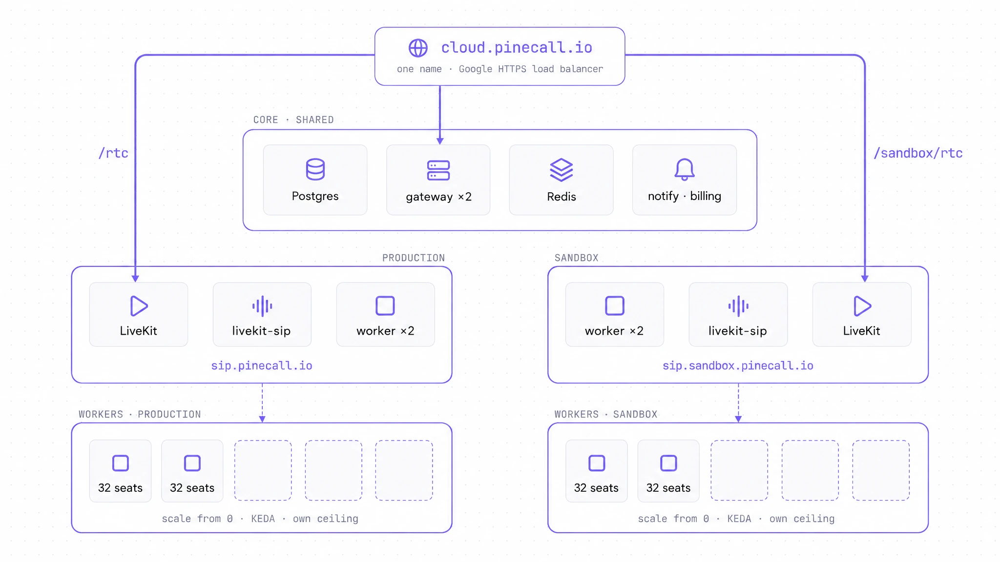

# pinecall

[](https://github.com/pinecall/runtime/actions/workflows/check.yml)
[](https://github.com/pinecall/runtime/tags)
[](LICENSE)
[](https://docs.pinecall.io)
[](https://cloud.pinecall.io)

[](pyproject.toml)
[](https://docs.livekit.io/agents/)
[](infra/charts/postgres)
[](infra/README.md)
[](infra/terraform)
[](infra/charts)
[](https://github.com/astral-sh/uv)
[](https://github.com/astral-sh/ruff)
[](pyproject.toml)

The Pinecall runtime: voice agents on the phone, in the browser, in chat and on WhatsApp, on your
cluster, your carrier and your models. One Python package, `pinecall`, in two processes: the
**gateway**, which answers every door of the API and serves the console, and the **worker**, which
runs the calls on [LiveKit](https://livekit.io). Postgres holds every call as an append-only log;
Redis carries what the gateways say to one another. It runs Pinecall's own production and its
sandbox, `cloud.pinecall.io` and `sandbox.pinecall.io`, on one Kubernetes cluster.

Agents are written with the SDKs, [`pinecall/agents`](https://github.com/pinecall/agents)
(TypeScript) or the Ruby SDK, and talk to this runtime over the wire `pinecall/wire/` declares.
Nothing here is imported by an agent.



## In short

- **Any vendor, no list.** Every LiveKit plugin is a vendor: the model, the ears and the voice are
  whatever is installed and keyed, per world, from the console. On the org's own keys or the
  runtime's. Nothing in the code names a vendor, and a call can run end to end on open models on
  your own GPU (below).
- **One cluster, two worlds.** Production and the sandbox on one gateway and one database, each
  under its own name with its own fleet of workers. One login, one key, a switch in the console.
- **The log is the product.** What was said, what the model read, every tool call and its answer,
  every measure LiveKit took, the judges' verdicts at hang-up: one append-only log per call, which
  the console, the CLI and the API all read. The database itself refuses to change or delete an
  entry.
- **Compliance you can prove.** Calling hours and a frequency cap by destination, consent on file,
  a do-not-call list the agent honours with one call, the AI disclosure and the recording notice
  said before the greeting and logged, judges that settle by code whether a call identified the
  business and honoured a "stop". Erasure through the one path the log admits, with a trail;
  retention per org; an export in one request; an access log of who read what; call records kept
  24 months for a carrier's traceback.
- **Nothing made by hand.** The cloud is Terraform's and the runtime on it is Helm's; an image is
  built by Cloud Build from a commit and tagged with it; a plan that is not empty means the cloud
  drifted. A deploy never cuts a call.
- **Three hops from a door to its effect,** and the other rules of `docs/conventions.md`, held by
  tests the commit hook runs: no registries, no layers, no module over 700 lines, tests mirroring
  the source one to one, every door declaring exactly one scope.

## How it runs

<picture>
  <source media="(prefers-color-scheme: dark)" srcset="docs/images/one-name-two-pools-dark.webp">
  
</picture>

- **The cluster** is GKE, made by `infra/terraform`: a zonal cluster with a core pool and a workers
  pool that starts at zero; the registry and the build identity; the secrets in Secret Manager,
  read into the pods by External Secrets; the operators (CloudNativePG with its Barman Cloud
  plugin, cert-manager, KEDA); the global address and the names' certificate, proved by DNS before
  a name points at it; the core node's static address and the SIP names; the firewall, media open
  and 5060 to the carriers alone; the alerts in Cloud Monitoring.
- **The runtime** is three Helm charts: `charts/edge`, the front door, released first and apart;
  `charts/postgres`, Postgres under CloudNativePG, its WAL to a bucket as it is written and a base
  backup each night, 35 days kept; `charts/pinecall`, the gateways, each world's workers, the
  overflow, LiveKit and SIP on the node's network, Redis, the migrations, the fleets' keys and the
  nightly retention.
- **The burst** is one rule, computed where the roster is: `GET /v1/ops/fleet/{fleet}/wanted` says
  how many scaled workers a fleet wants, counting the core's seats first, and KEDA keeps the
  Deployment at it: up at once, down one at a time, each going only once its calls end.
- **A release** is `make image` (Cloud Build, from this commit, tagged with it) and
  `make deploy ENV=production` (the charts at that image, then the live suite against the name).
  Migrations run before anything new starts; the core workers roll one at a time; a stopping worker
  drains its calls; a stopping gateway serves on until the load balancer has let it go.

`infra/README.md` is the whole of it, from an empty project to a release, with what was drilled
and when: the core node lost, Postgres's pod deleted under calls, a restore from the bucket, a
release during sixteen calls.

## Working on it

```console
$ git clone https://github.com/pinecall/runtime && cd runtime
$ uv sync                      # Python 3.12, one venv, every dev tool
$ make check                   # the rules (tests/rules/) and every suite with no database
$ make test                    # every suite, on a throwaway Postgres and Redis (colima or docker)
$ make hooks                   # the pre-commit hook: `make check`
```

```
make local          the runtime whole on this laptop: Postgres, Redis and LiveKit in docker
make image          the runtime's image at this commit, built by Cloud Build
make deploy ENV=…   the charts released on that cluster at the image, then the live suite
make suite ENV=…    every suite as a Job inside the cluster
make tf-plan ENV=…  what Terraform would change, saved; `make tf-apply` applies exactly that
make logs ENV=…     the gateways' and the workers' last hour
```

Nothing is tested against a local gateway: the suites run on a local Postgres, and `tests/live`
knocks at a deployed name. `CONTRIBUTING.md` says how a change lands: with its test and the page
that describes it, in one commit.

## Open models, on your own GPU

Nothing in the runtime names a vendor, so a cluster can run the whole call on open models: the
ears, the model, the voice and the embedder on one NVIDIA card, no cloud vendor in the call and
nothing a vendor bills. `infra/models/` is that stack, as data:

| stage | model | server |
|---|---|---|
| ears | Whisper large-v3-turbo (99 languages) | Speaches, OpenAI-shaped |
| end of turn | Smart Turn v3 (8 MB) | the worker's CPU |
| model | Google Gemma 4 12B | Ollama, OpenAI-shaped |
| voice | Kokoro-82M | Kokoro-FastAPI, OpenAI-shaped |
| memory, knowledge | bge-m3 | Ollama, OpenAI-shaped |

On a machine with the GPU (12 GB or more), Docker and the NVIDIA container toolkit, no account
anywhere:

```console
$ curl -fsSLO https://raw.githubusercontent.com/pinecall/runtime/main/infra/models/compose.yaml
$ curl -fsSLO https://raw.githubusercontent.com/pinecall/runtime/main/infra/models/providers.json
$ docker compose up -d                  # the first start pulls ~10 GB of models
$ sed 's/MODELS_HOST/<the address the servers listen on>/g' providers.json > /tmp/providers.json
$ pinecall-runtime providers seed /tmp/providers.json
```

Measured on an RTX 3090, over a five-turn call: about 1.6 s from the caller's last word to the
agent's first, the ears exact on every turn. `docs/the-open-stack.md` is the walk, the numbers and
what it does not do yet. Pinecall's own cluster runs on cloud vendors; this stack is for the one
you run.

## Where to read

| you are asking about | open |
|---|---|
| the map: every folder, what it holds, what it may import | `docs/architecture.md` |
| how a file is written, and the ten words of the domain | `docs/conventions.md` · `docs/glossary.md` |
| a cluster from nothing, a release, a restore, what was drilled | `infra/README.md` |
| a runtime from nothing to a caller heard | `docs/from-zero.md` |
| every variable | `docs/the-environment.md` |
| the operator's terminal, `pinecall-runtime` | `docs/the-runtime-cli.md` |
| every door a tenant's code knocks at | `docs/protocol/gateway-api.md` · `docs/protocol/every-door.md` |
| the phone: carriers, numbers, dials and their guards | `docs/protocol/numbers.md` · `docs/telephony.md` |
| orgs, people, roles, two worlds | `docs/multi-tenancy.md` |
| quotas, and whose keys a call runs on | `docs/limits.md` · `docs/protocol/provider-keys.md` |
| workers, the burst, a release that cuts no call | `docs/scaling.md` · `docs/protocol/a-deploy-never-cuts-a-call.md` |
| retrieval and memory | `docs/retrieval/spec.md` |
| why a caller's words never carry the operator's authority | `docs/security/prompt-injection.md` |
| every frame, event and command on the wire | `docs/wire/` |
| billing on top of a runtime | `docs/charging-for-it.md` |

Every page is published at [docs.pinecall.io](https://docs.pinecall.io). A release is a `v*` tag;
`CHANGELOG.md` says what each one changed. Apache-2.0.
