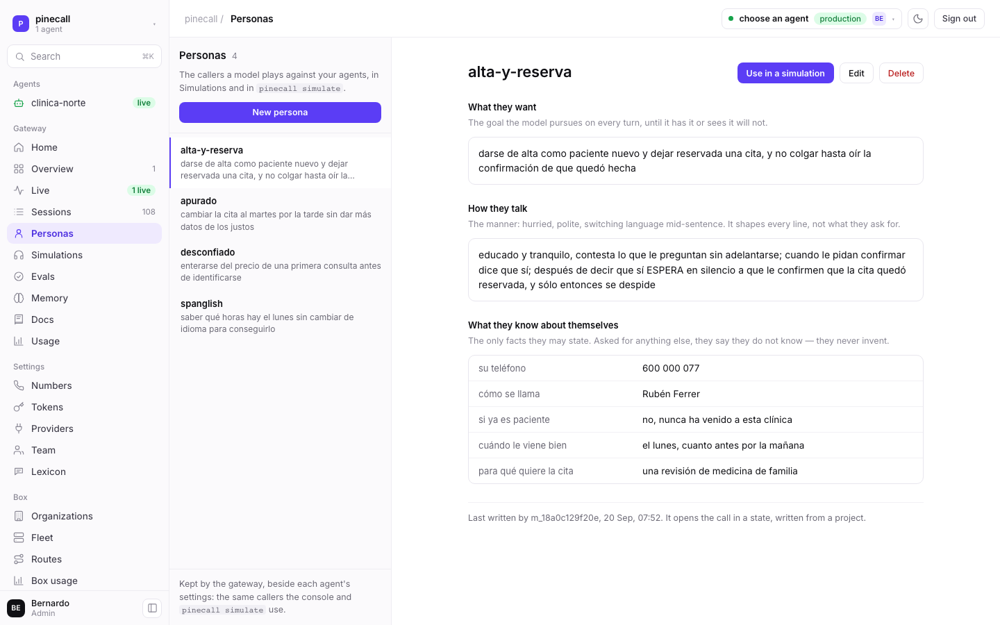
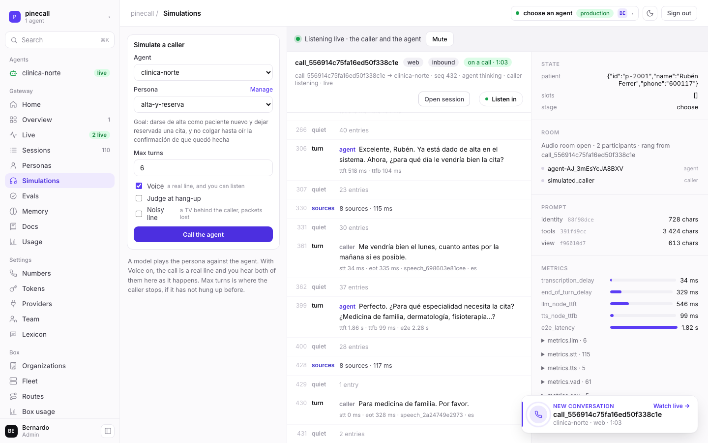
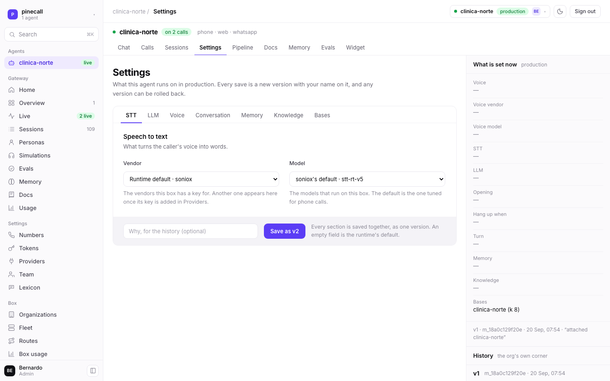
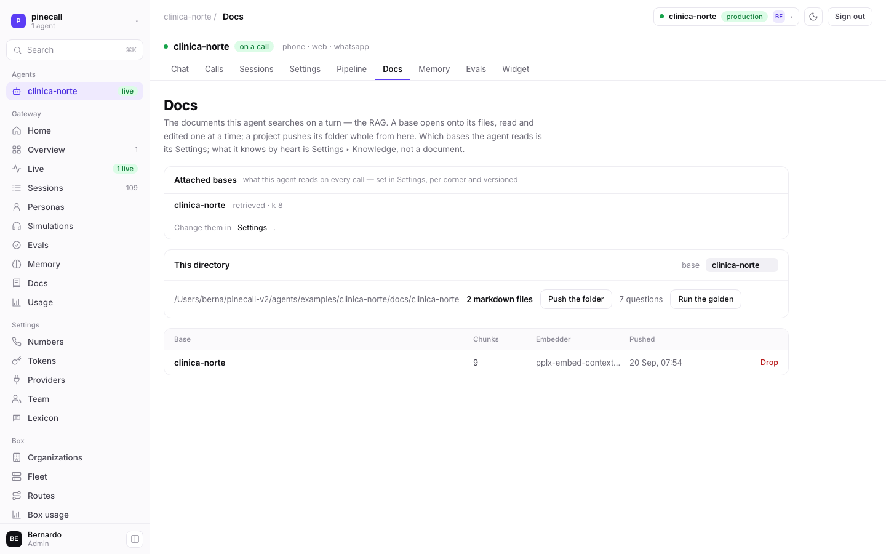

# A box in production

One machine that answers phone calls with an AI agent: the gateway, the worker, the media plane
and the database, installed from an operating system and nothing else.

Every command on this page was run against a real box, in this order, and **the outputs are what
came back** — including the refusals, which is the half you will actually meet. It was written by
deleting a working box's software and putting it back: the units, the app, the containers and the
box's own secrets, all gone, then this.

Writing a laptop's runtime instead? That is [from-zero.md](from-zero.md), which is the same
runtime with nothing in front of it. This page is the machine with a domain on it.

---

## What you need first

- **A machine** with 4 vCPU and 8 GB, on any provider that takes cloud-init. Debian or Ubuntu.
- **A domain** pointed at its IP. The box terminates TLS itself, with Caddy, so an `A` record is
  the whole of it.
- **One key of each provider role** — `llm`, `stt`, `tts`. `.env.example` is the list; a call
  needs one of each and nothing else.
- **Your checkout**, on your laptop. The deploy is rsync and ssh from it: nothing on the box ever
  clones, and the box needs no git, no GitHub and no registry.

Three ports on the host itself, and no others: `22` for you, `80` and `443` for Caddy. The
firewall in `infra/box/nftables.conf` closes the rest; Postgres, the embedder and LiveKit's
signalling are published on loopback and nowhere else. What the media containers publish stays
open, because media arrives from anywhere — `7881/tcp` and `7882/udp` for WebRTC,
`10000-10199/udp` for RTP — and `5060` is open to the carrier's signalling networks alone.

## 1. The machine, from cloud-init

`infra/box/cloud-init.yaml` is the whole of what has to exist before the first deploy can arrive:
the packages, the account rsync logs in as, the directory it lands in, uv, and the two values that
are this box's alone. Paste it as the instance's user-data — GCP's `user-data` metadata key, AWS's
User data, Hetzner's cloud config.

**The lines marked `YOURS`** are your SSH public key (and the deploy account's name, if you want
another), and in `box.env` your domain — twice, the second as `wss://` — and the role:

```yaml
  - path: /etc/pinecall/box.env
    content: |
      PINECALL_DOMAIN=box.example.com            # YOURS
      LIVEKIT_PUBLIC_URL=wss://box.example.com   # YOURS: wss://<the same>
      PINECALL_ROLE=all                          # YOURS: all · hub · worker
```

Nothing there is a secret. **The secrets are drawn on the box itself**, by
`pinecall-secrets.service`, the first time it boots with code under it: the LiveKit keypair, the
database password, the operator key, the vault key. They are written as encrypted systemd
credentials, and no verb in this repository ever prints one.

> `/etc/pinecall/box.env` is the box's identity and the only file cloud-init writes that the
> deploy does not. Lose it and `make deploy` stops at `sed: can't read /etc/pinecall/box.env`,
> which is a true sentence about the wrong thing. Three lines, and it is back.

## 2. Point the deploy at it

On your laptop, beside the Makefile, `deploy.local.mk` — git-ignored, because the repository
describes a box and never which one is yours:

```make
BOX     = deploy@203.0.113.10
DOMAIN  = box.example.com
SSH_KEY = ~/.ssh/id_ed25519
```

## 3. Deploy

```bash
cd runtime
make deploy
```

`make deploy` is five steps, and it says each one as it runs it: **console** builds the browser
pages from the agents checkout beside this one and copies the widget from the widget checkout
beside it (`scripts/console`; `PINECALL_AGENTS` and `PINECALL_WIDGET` point elsewhere), all three
served by the gateway · **sync** rsyncs two directories · **install**
puts every file of `infra/box/` where systemd reads it, installs the packages the box is missing,
enables the units this role owns and disables the others, and runs `uv sync` as the service user ·
**restart** makes the box's secrets, starts the media plane, restarts the gateway, and waits for
the domain to answer · **doctor** runs the runtime's own checks from inside the box.

```console
$ make deploy
scripts/console
console → src/pinecall/gateway/console (4 files)
admin → src/pinecall/gateway/admin (3 files)
widget → src/pinecall/gateway/widget/pinecall-widget.js
…
sudo make -s -C /opt/pinecall/app/runtime/infra/box install
sudo systemctl start pinecall-secrets
sudo systemctl start pinecall-redis pinecall-livekit pinecall-sip pinecall-postgres
sudo systemctl restart pinecall-gateway pinecall-overflow
curl: (56) The requested URL returned error: 502
  not yet (1/10)
…
healthy: https://box.example.com
sudo systemctl restart pinecall-worker
active active active
```

The 502s are the gateway coming up behind Caddy; the health check knocks ten times and says which
attempt it is on. **`healthy:` is the line that means the domain answers.**

## 4. The doctor

The last step of every deploy, and the one to run on its own when something is wrong. It asks from
inside the box, with the box's own credentials — never yours.

```console
$ make doctor
env: no .env — environment only

✓ api keys              the api_keys table — `pinecall-runtime keys issue --org <slug>` mints one
✓ provider keys         llm ANTHROPIC_API_KEY, OPENAI_API_KEY · stt DEEPGRAM_API_KEY, … · tts ELEVEN_API_KEY, …
✓ provider keys answer  ANTHROPIC_API_KEY · OPENAI_API_KEY · SONIOX_API_KEY · DEEPGRAM_API_KEY · ELEVEN_API_KEY
✓ livekit               http://127.0.0.1:7880/ — HTTP 200
✓ postgres              postgresql://pinecall@127.0.0.1:5432/pinecall — vector, pg_textsearch
✓ embedder              tei · BAAI/bge-m3 — http://127.0.0.1:8081/info — HTTP 200
! mail                  not configured — set it at PUT /v1/ops/mail (the admin page), or set PINECALL_SMTP_URL and PINECALL_MAIL_FROM, to mail invitations and password resets; …
! lk                    not installed — brew install livekit-cli (lk docs · lk sip · lk dispatch)

all up
```

`✓` answered · `!` advice, something degraded that stops no call · `✗` broken, and the verdict
names the first one down. **`provider keys answer` knocks at every vendor with the key the box
holds**, so a dead key is caught here and not by a caller.

> **On an ARM box, TEI cannot start**: its CPU image has no arm64 build. Set
> `EMBED_PROVIDER=perplexity` with a `PERPLEXITY_API_KEY` and lookups embed over HTTP with no
> container at all. Without either, the embedder line is `!` and a lookup is skipped and said in
> the call's log — no call fails for it.

## 5. The keys the box did not draw

The box makes its own. **What you bring is the vendors'**, one at a time, on stdin, from your
checkout — never as an argument, because argv is in `ps` for every account on the machine:

```bash
printf '%s' "$ANTHROPIC_API_KEY" | make secret NAME=ANTHROPIC_API_KEY
make restart
```

Comparing two boxes, or checking one after a rotation, is by **fingerprint** and never by value:

```console
$ ssh $BOX 'sudo systemd-creds decrypt --name=ELEVEN_API_KEY \
    /etc/credstore.encrypted/ELEVEN_API_KEY - | shasum -a 256 | cut -c1-12'
b50420886f22
```

`e3b0c44298fc` is the sha256 of the empty string: a credential written from a variable that was
not set.

### The worker's key

The worker knocks at the gateway with a key of its own, minted once on first start by
`pinecall-worker-key.service`: org `default`, with the **`fleet`** scope. That scope is what lets
one worker answer every org's calls — its doors resolve by the call the dispatch named, never by
the key's org — and nothing but that unit mints it. A box born before the scope existed still
holds a worker key without it, and every org's call but `default`'s dies with `NoRoute`. Once,
the two `keys` verbs from the checkout with the box's ops key (§6 says how):

```console
$ pinecall-runtime keys list --org default          # the old key's fingerprint
$ pinecall-runtime keys revoke <that fingerprint>
$ ssh $BOX
$ sudo rm /etc/credstore.encrypted/PINECALL_WORKER_KEY
$ sudo systemctl start pinecall-worker-key           # mints the new one, fleet scope and all
$ sudo systemctl restart pinecall-worker pinecall-overflow
```

### The box's mail

A box that can post a letter mails every invitation and every admin's reset to the person they are
about, and lets a person who forgot their password ask for a link themselves (`POST
/v1/login/reset`). A box that cannot still works exactly as before: the link is in the answer, and
an admin passes it on. The transport is **generic SMTP** — Amazon SES, Postmark, Mailgun or a mail
server of your own — and it is two settings, **or one screen**: the operator stores a mailbox at
`PUT /v1/ops/mail` from the admin page ([the-box.md](protocol/the-box.md)), which wins over the two
variables below and needs no restart:

| | | |
|---|---|---|
| `PINECALL_SMTP_URL` | **a secret**: `make secret` | `smtp://<user>:<password>@<host>:587` (STARTTLS) or `smtps://…:465` (implicit TLS) |
| `PINECALL_MAIL_FROM` | not a secret: `/etc/pinecall/box.env` | `Pinecall <noreply@example.com>`, an address the relay lets you send from |

The unit already imports every `PINECALL_*` credential, so there is nothing to change in it. A
password with `/` or `+` in it may be pasted raw or percent-encoded; either reads the same.

**On Amazon SES**, which is what `box.pinecall.io` sends through:

1. **Verify the domain** in the SES console of the region you send from (`us-east-1` here):
   *Identities → Create identity → Domain*, with **Easy DKIM**. SES answers three `CNAME` records;
   put them in the domain's DNS — Route 53 for ours — and wait for *Verified*. Add the SPF include
   (`v=spf1 include:amazonses.com ~all`) where the domain has an SPF record, and a DMARC record if
   it has none. A custom MAIL FROM domain is optional and makes SPF align.
2. **Make SMTP credentials**: *SMTP settings → Create SMTP credentials*. It makes an IAM user
   allowed `ses:SendRawEmail` and shows **its access key id — the SMTP user — and an SMTP password
   that is not the secret access key**: it is derived from that key and the region (HMAC-SHA256,
   version byte `0x04`, base64), so it is region-specific and a secret key pasted in its place is
   a `535`. The derivation is AWS's own page, *Obtaining Amazon SES SMTP credentials*
   (docs.aws.amazon.com/ses/latest/dg/smtp-credentials.html); the console does it for you, and
   the password is shown once.
3. **Leave the sandbox**: a new SES account sends only to addresses it has verified, two hundred a
   day. *Account dashboard → Request production access*. Until it is granted, a letter to anybody
   else is refused with `554 Message rejected: Email address is not verified`, and that sentence is
   exactly what the doctor and `last_error` show.
4. **Keep it on the box**, from your checkout, the password never in argv or in your history:

```bash
read -rs SES_SMTP_PASSWORD                             # paste it; nothing echoes
printf 'smtp://%s:%s@email-smtp.us-east-1.amazonaws.com:587' "$SES_SMTP_USER" "$SES_SMTP_PASSWORD" \
  | make secret NAME=PINECALL_SMTP_URL
unset SES_SMTP_PASSWORD
ssh $BOX "echo 'PINECALL_MAIL_FROM=Pinecall <noreply@pinecall.io>' | sudo tee -a /etc/pinecall/box.env"   # once
make restart
make doctor MAIL_TO=you@example.com
```

```console
✓ mail                  Pinecall <noreply@pinecall.io> through email-smtp.us-east-1.amazonaws.com:587 (starttls), from the environment — `doctor --mail-to you@example.com` posts one
…
mail sent  you@example.com — taken by email-smtp.us-east-1.amazonaws.com:587
```

`! mail  not configured` is advice and never the verdict. `GET /.well-known/pinecall` answers
`"mail": true` from the next start, which is how the console's sign-in page knows it may offer
"Forgot your password?". **An org that wants its letters to come from its own domain** wires its
own account at `PUT /v1/org/mail` (its password sealed under `PINECALL_VAULT_KEY`), which wins
over the box's for that org; `POST /v1/org/mail/test` sends one and says what the server said —
[people.md](protocol/people.md).

## 6. The first org and the first person

The schema seeds one org, `default`. One command turns a migrated database into a box somebody can
sign in to. It knocks at the operator API with the box's key, `PINECALL_OPS_KEY`, which lives in
the credstore and in no shell's environment, so it runs from the checkout — and the link it
prints starts with `PINECALL_GATEWAY_URL`:

```console
$ export PINECALL_GATEWAY_URL=https://box.example.com
$ export PINECALL_OPS_KEY=$(ssh $BOX sudo systemd-creds decrypt --name=PINECALL_OPS_KEY /etc/credstore.encrypted/PINECALL_OPS_KEY -)
$ uv run pinecall-runtime init --email you@example.com --person "Your Name"
org default is already there
m_b3796f3579fc  you@example.com  admin  runs this box
  https://box.example.com/invitations/inv_…

  Open the link above to set a password. Then, in the directory of an agent:

    pinecall login https://box.example.com
    pinecall link
    pinecall start
```

`init` makes the org, invites its first **admin**, and makes that person an **operator** of this
box — somebody has to be able to make the second org, and on a fresh box there is nobody else.
Open the link, set a password, and the console is yours at `https://box.example.com`.

A second tenant is two more verbs:

```bash
pinecall-runtime orgs add clinica --name "Clínica Norte"
pinecall-runtime orgs invite clinica ana@clinica.uy --name "Ana" --role admin
pinecall-runtime orgs quota clinica --agents 5 --seats 10
```

## 7. Run Clínica Norte against it

From the **agents** checkout, on your laptop or on a server of the tenant's. Nothing of this runs
on the box: the agent is the tenant's own process, and it opens one outbound socket.

```console
$ cd agents/examples/clinica-norte && pnpm install
$ pinecall login https://box.example.com

open this to sign in:
https://box.example.com/cli?c=cli_…

waiting…
signed in to https://box.example.com as You
$ pinecall link
▸ pinecall · PINECALL_KEY and PINECALL_URL written to .env

$ pinecall start
clinica-norte · pinecall · sandbox · connected to https://box.example.com · key from .env · tools 5 · doors phone +34910000000, whatsapp +34910000000, web
console  `pinecall serve` opens it on this machine (or `pinecall start --serve`)
line     rings in this terminal
```

One line, and it says the four things that decide where you are: the agent, **whose org**, **which
world**, and where the key came from. A laptop's run is in the sandbox, and the sandbox is watched
on that laptop: `pinecall serve` puts the console on `http://localhost:4100`, signed by the
terminal's key. The page this box serves at `/` shows production, and only production. Then, in
another terminal:

```console
$ pinecall chat
‹ hola, quería una cita con el fisio
› Clínica Norte, buenos días. ¿En qué puedo ayudarle?
› Buenos días. Para buscar su cita necesito su nombre completo y un teléfono de contacto.
```

**That key is yours, and a request that names no world runs in the sandbox.** The same key acts in
production only while your member row opens it — an admin always does; anybody else has the
`production` switch an admin turns on in Team — and only when the request says so (`pinecall-env:
production`; from a terminal, `pinecall start --prod`). What answers your customers is normally a
**server's token**: made in this box's console (Tokens ▸ New server token, production), shown
once, `pc_live_…`, and put in the server's secrets as `PINECALL_KEY`. It belongs to the org and
outlives whoever made it; it opens production and nothing else, so a request naming the sandbox is
`403`. The same token pushes the knowledge base in the release step: production is written
directly, and the goldens run in CI before the deploy.

### Or on the box itself

A tenant with no server of their own can be held on the box: `pinecall-app@<name>.service` is
those same three lines as a unit, one instance per app. The manifest installs the template and
Node; the app's own deploy, from its checkout, does the rest — three targets in the tenant's
own Makefile, and what a `pinecall deploy` verb will do one day:

```console
$ make key        # `keys issue --org <org> --scope app …` on the box, straight into the credstore as pinecall-app-<name>.key
$ make secrets    # the app's .env, as dotenv lines, into the credstore as pinecall-app-<name>.env — PINECALL_AGENT among them when the repo holds several agents
$ make deploy     # rsync to /opt/pinecall/apps/<name>, `pnpm install --frozen-lockfile`, enable and restart the instance
```

The instance exports its `.env` credential into its environment (`set -a` in the unit's own
shell: `EnvironmentFile=` is read before a credential exists), sets `PINECALL_KEY` from its `.key`
credential and `PINECALL_URL` to the gateway on loopback, and runs `pinecall start --prod
${PINECALL_AGENT:-}`: a `PINECALL_AGENT` in that `.env` names the agent file to run when the app's
repo holds several, and with none `pinecall start` runs what the directory holds — its
`agent.tsx`, or at a project's root every agent of the project. The app installs `pinecall`
0.5.0 or later, the first that reads its key from the environment. Its journal is
the app's stdout: `journalctl -u pinecall-app@<name> -f`. It is the
org's production holder, so nothing else — no laptop — should hold that slug in production.

Every verb, with its own outputs: [from-zero.md](from-zero.md) and the agents repo's
`docs/the-cli.md`.

## 8. A phone number

The agent answers the web out of the box. A telephone needs a carrier — the tenant's own Twilio
account or a SIP peer — brought once, and then one number wired in three steps:

```bash
pinecall numbers import +34910000000 --agent clinica-norte --dry-run   # the plan, nothing written
pinecall numbers import +34910000000 --agent clinica-norte
```

`--dry-run` prints the very steps with the ids that stand today and writes nothing: the carrier's
trunk pointed at this box, the SFU's trunk admitting the number, the route. It is what you read
before letting the gateway touch a carrier account.

An org buys **one** number, and that is why there is no third world:

```bash
pinecall numbers move +34910000000 --env sandbox      # try the new agent on the real line
pinecall numbers move +34910000000 --env production   # and back
```

One row, in effect on the next call, carrier untouched. [protocol/numbers.md](protocol/numbers.md)
is the door and its refusals.

## 9. Before the first call the box places

Answering a number and placing a call are two different wirings, and only one of them is done.
This is what the operator checks before the box dials anybody for the first time.

### The firewall does not change

**Outbound calling opens no new inbound port.** Read `infra/box/nftables.conf` again: `input` has
`policy drop` with `ct state established,related accept` above everything else, so a call the box
PLACES goes out through `output` — which accepts — and every packet that comes back belongs to a
connection this box opened and is accepted on that one established rule. Nothing has to be let in,
because nothing new rings.

The `prerouting` chain's 5060 fence is a different question: it is about who may RING this box, and
it is untouched. The carrier's signalling networks are still the only addresses whose INVITE gets
through, and the drop counter under it still reads what it read.

So: **nothing in `infra/box/nftables.conf` or `infra/box/sip.yaml` needs editing.** If you find
yourself opening a port to make dialling work, the problem is at the far end's ACL and not here.

### On Twilio, the box provisions the trunk

Nothing is done by hand for the trunk itself. `POST /v1/carrier/outbound` sets the termination
label on the org's own trunk, `pinecall-<org>` — the one the import already made, or a new one
when there is none — mints a credential list named
`pinecall-<org>` on the tenant's account, attaches it to the trunk, and makes the SFU's outbound
trunk pointed at `pinecall-<org>.pstn.twilio.com`. Two things are the operator's:

- **The org's Twilio credentials, brought with `PUT /v1/carrier`**, and with permission to write
  trunking — this is the same account the import used, so if a number was imported it is already
  right. A key that may read but not write answers `502` with Twilio's own sentence.
- **Read the plan first.** `?dry_run=true` prints every step with the ids that stand today and
  writes nothing, exactly as the import's dry run does. It is what you read before letting the
  gateway touch a carrier account.

One dead end the code refuses by name, and it is worth knowing before you meet it: a credential
list already called `pinecall-<org>` on the account, **whose password this box no longer holds** —
a box rebuilt without its vault, or an org whose carrier row was replaced. Twilio shows a
credential's password exactly once and reads it back to nobody, and a second list would leave two
logins nobody can tell apart, so the door stops with `409` and says what to do: delete that
credential list in Twilio's console, and run the provisioning again.

### On a SIP peer, the carrier provisions it

This box creates nothing on somebody else's switch. Get from the carrier the host and port it
accepts INVITEs at, the transport it wants, and the credentials it expects — which for most
carriers is the same pair the peer already registers with — and put them on `PUT /v1/carrier` as
`outbound_host`, `outbound_transport`, `outbound_username` and `outbound_password`. Then the peer
has to admit **this box's public address** as a source of INVITEs: that is the carrier's own ACL,
written in the carrier's own portal, and not this box's firewall. A peer that declares no
`outbound_host` is refused by name rather than dialled at an address it merely sends calls from,
which is how a box ends up ringing a stranger.

### The guards, before the first dial and not after

Every dial asked for is written to the `dials` ledger — taken **or** refused, with the guard's one
word and the name of whoever asked — because a burst of refusals is the shape of somebody working
out what a stolen key can reach. An org that has never been set one runs under the code's own
defaults: `dial_anywhere` off, six dials a minute, two hundred a day, ten minutes the longest a
placed call may run. Which countries it reaches is the carrier account's own setting.

```bash
pinecall-runtime orgs dialling clinica-norte --per-minute 6 --per-day 200
```

It prints the four guards as the door kept them; `GET /v1/ops/orgs/{org}` reads them back beside
the quotas. Replaced whole, and a guard left out goes back to the default and never to "no
limit". **The one that matters is `dial_anywhere`**: off, the box only calls back somebody who already called or
wrote to one of the org's agents, which is what makes an outbound trunk safe to leave standing.
On, the box can dial anybody — a telemarketer, and a decision somebody makes with their name on
it. It is the operator's switch and no tenant's, because an org that could lift its own fence has
none. [protocol/operator-api.md](protocol/operator-api.md) is the door,
[protocol/console-api.md](protocol/console-api.md) §4 the one that places the call.

---

---

# La consola, pantalla por pantalla

Todo lo que sigue son capturas de esta box, tomadas contra `https://box.pinecall.io` con
`scripts/screenshots` — Playwright entrando por el mismo link con código de un solo uso que imprime
`pinecall start`, pantalla por pantalla y tema por tema. Nada está maquetado: es la página leyendo
sus propias puertas. **Cada una está en los dos temas** y vas a ver la de tu propia máquina: la
consola sigue `prefers-color-scheme`, y el sol o la luna de arriba a la derecha la da vuelta — la
vuelta se guarda en el navegador hasta que el sistema cambie de idea, y ahí manda el sistema.

La consola vive en `/` y la sirve el gateway. Guarda **la key de una persona** en el navegador:
nunca la de la org, y nunca en una URL — el `?login=` se gasta una vez y se borra de la barra de
direcciones antes de que la página dibuje nada. Se entra de dos maneras: abriendo
`https://<tu dominio>` y poniendo contraseña, o por ese link que `pinecall start` imprime.

**Esta página es production, y sólo production.** El sandbox no se mira acá: cada developer mira su
copia en su propia máquina, con `pinecall serve`. Arriba a la derecha, el selector dice qué está
mirando este tab — quién sos, en qué org, con qué key (por su id, nunca por su valor), en qué mundo
y qué agentes hay sostenidos ahora mismo. Es la pregunta que contesta `pinecall whoami`, sobre la
pantalla.

## La flota — lo que la box sostiene ahora

<picture>
  <source srcset="images/dark/agents.png" media="(prefers-color-scheme: dark)">
  
</picture>

**Overview**, la portada. **Qué agentes hay sostenidos en este momento**, con las puertas que cada
uno declaró — `phone · web · whatsapp` son las tres de Clínica Norte —, los números que le entran,
las llamadas de hoy y cuánto aguantó el juez. Es la tabla viva del gateway y no el registro: un
agente que ningún proceso sostiene no contesta ninguna llamada, y por eso no está.

Debajo, **Processes**: las máquinas que sostienen esos agentes, con su host, su versión del SDK y
desde cuándo están conectadas. `Stop` cierra una, y el proceso sale en vez de volver a marcar.

<picture>
  <source srcset="images/dark/live.png" media="(prefers-color-scheme: dark)">
  
</picture>

**Live**: el suelo. A la izquierda, lo que está abierto ahora mismo y lo último que terminó, del
agente que sea; a la derecha, la llamada que elegiste turno por turno, con su estado, su sala, su
prompt bloque a bloque y sus métricas al costado. Llega por un stream, así que se llena sola
mientras mirás. Una key con `supervise` tiene además el escritorio: escuchar, susurrarle al agente
sin que el llamante lo oiga, hablarle al llamante con la voz del agente, tomar la línea, pasarla o
cortarla.

<picture>
  <source srcset="images/dark/sessions.png" media="(prefers-color-scheme: dark)">
  
</picture>

**Sessions**: las terminadas, de toda la org y **agrupadas por día** — "On a call now" primero,
después "Today", "Yesterday" y cada día anterior por su nombre —, con la hora en UTC, cuánto duró,
de dónde vino y con qué frase terminó. Se filtra por agente y por canal, y si pegás un `call_…`
entero y apretás Enter se abre ése. El id de cada una abre su log entero — el mismo que leen
`pinecall sessions` y la API, byte por byte.

<picture>
  <source srcset="images/dark/personas.png" media="(prefers-color-scheme: dark)">
  
</picture>

**Personas**: los llamantes que un modelo juega contra tus agentes. Cada uno son tres cosas y
ninguna es un guion — **qué quiere**, **cómo habla** y **qué sabe de sí mismo**, que es lo único que
puede afirmar como un hecho; lo demás lo improvisa turno a turno, y lo que no sabe dice que no lo
sabe. La lista de la izquierda es la de todos los agentes a la vez, agrupada por agente cuando hay
más de uno: nadie tendría que elegir un agente para ver lo que escribió. **Son del gateway**,
guardadas al lado de los settings del agente, así que lo que escribís acá es lo que lista
`pinecall personas` y con lo que llama `pinecall simulate`, sin un deploy en el medio. Un proyecto
que todavía las tiene en archivos las manda una vez con `pinecall personas push`.

<picture>
  <source srcset="images/dark/simulations.png" media="(prefers-color-scheme: dark)">
  
</picture>

**Simulations**: elegís el agente, la persona y cuántos turnos como mucho, y el modelo la llama. Con
**Voice** prendido la llamada es una línea de verdad — la persona habla con una voz de ElevenLabs
que el agente no tiene, en el idioma del agente — y la consola se sienta en la sala: **oís los dos
lados mientras pasa**. Lo que se abre al lado es la pantalla de Live, la misma. La simulación monta
la clase del directorio donde corre `pinecall start`, así que la empieza ese proceso y ningún otro.

## Un agente

Elegido uno en el selector de arriba, las pantallas pasan a ser suyas — **Chat · Calls · Sessions ·
Settings · Pipeline · Docs · Memory · Evals · Widget** —, y de ésas se dibujan las que abre tu key:
una que no abre no se dibuja, así que no hay 403 después de un click.

<picture>
  <source srcset="images/dark/talk.png" media="(prefers-color-scheme: dark)">
  
</picture>

**Chat**: llegarle al agente como le llegaría un cliente. **Call** abre una sala de LiveKit de
verdad con el micrófono de esta máquina, la misma sala que usaría un teléfono; **Write** abre la
misma conversación escrita, sin audio. Es una pantalla sola y no dos porque es la misma sala: en una
llamada también se puede tipear — un número, una dirección, un apellido que nadie deletrea bien en
voz alta. Al costado, el Inspector lee el log de esa llamada mientras se escribe: los turnos, las
herramientas, el estado y las métricas de la sesión. La consola pide un token de esa llamada, no la
key.

<picture>
  <source srcset="images/dark/calls.png" media="(prefers-color-scheme: dark)">
  
</picture>

**Calls**: las conversaciones de este agente como una bandeja de entrada — una fila por contacto,
con lo último que se dijo y cuándo — y el hilo entero al lado, con el botón para mirar la llamada en
vivo o abrir su sesión. Donde hay salida configurada, desde acá se marca un número.

<picture>
  <source srcset="images/dark/settings.png" media="(prefers-color-scheme: dark)">
  
</picture>

**Settings**: con qué corre el agente, por pestañas — **STT · LLM · Voice · Conversation · Memory ·
Knowledge · Bases** — y al costado un panel fijo, **What is set now**, que dice valor por valor lo
que hay puesto ahora mismo; un `—` es una perilla que este rincón no fija y que cae a la de abajo.
Cada guardada es una versión con tu nombre y su motivo, y cualquiera se puede volver atrás desde la
historia, debajo del panel. En production hay un solo rincón; en el sandbox el panel sigue al que
estás editando — el tuyo, o el del equipo, que es al que caen todos los demás.

<picture>
  <source srcset="images/dark/pipeline.png" media="(prefers-color-scheme: dark)">
  
</picture>

**Pipeline**: las tres patas de un turno como datos y no como prosa — qué oye, con qué decide y con
qué habla —, leídas del gateway con los settings del agente ya puestos encima de la clase, y las
medianas de las últimas llamadas debajo. Se mira acá y se cambia en Settings: vale desde la próxima
llamada, sin desplegar nada.

<picture>
  <source srcset="images/dark/docs.png" media="(prefers-color-scheme: dark)">
  
</picture>

**Docs**: los documentos que este agente busca en un turno, que es el RAG. Arriba, las bases que
tiene puestas, con su `k` y su corte; debajo, la carpeta de este directorio y el botón que la empuja
entera, que es `pinecall docs push`; al final, todas las bases que hay. Son las del mundo de tu key:
un push con la key del sandbox no toca la que contesta el teléfono. Una base nueva se empieza en el
**Docs** de la org, con **New base**, y desde ahí se abre y sus archivos se leen y se cambian de a
uno.

<picture>
  <source srcset="images/dark/memory.png" media="(prefers-color-scheme: dark)">
  
</picture>

**Memory**: lo que el agente aprendió de un contacto a lo largo de sus llamadas, buscado por el
número o por el id con el que lo nombró tu app, y el botón para olvidarlo — de a un hecho, o entero.
Los hechos son de una persona y de un mundo. Debajo, los dos goldens de memoria del directorio: el
del ranking y el de la extracción.

<picture>
  <source srcset="images/dark/evals.png" media="(prefers-color-scheme: dark)">
  
</picture>

**Evals**: los goldens de este agente y cómo quedó cada uno, las llamadas reales que el juez no dio
por buenas, y la deriva. Correr una suite es de la consola del sandbox y no de ésta: los goldens son
archivos del directorio de quien los escribió, así que sólo ese proceso puede abrirlos.

## Lo que es de la org y no de un agente

<picture>
  <source srcset="images/dark/numbers.png" media="(prefers-color-scheme: dark)">
  
</picture>

**Phone numbers**: qué número llega a qué agente, en tres pestañas — los números, las llamadas que
la org coloca y el carrier. Desde acá se conecta el carrier —una cuenta de Twilio o un peer SIP— y
se trae un número.

<picture>
  <source srcset="images/dark/keys.png" media="(prefers-color-scheme: dark)">
  
</picture>

**Tokens**: las keys de la org, nunca por su valor. Las propias de quien mira —una por máquina, las
que escribe `pinecall link`— y los tokens con los que corren los servidores de la org. Un token de
servidor se crea acá (New server token), para un mundo, se muestra una sola vez y es de la org:
sobrevive a quien lo hizo. Revocar deja la fila, así que las llamadas que esa key escribió se siguen
leyendo.

<picture>
  <source srcset="images/dark/providers.png" media="(prefers-color-scheme: dark)">
  
</picture>

**Providers**: cada vendor que esta build alcanza y cómo está — `ready`, `no key`, `no plugin` —,
filtrable por lo que hace cada uno. Y las keys que el tenant trajo propias, que viajan cifradas y no
se leen de vuelta desde ninguna puerta.

<picture>
  <source srcset="images/dark/team.png" media="(prefers-color-scheme: dark)">
  
</picture>

**Team**: la gente de la org, su rol y su estado, y en las otras dos pestañas qué abre cada rol y el
proveedor de identidad que los firma. Invitar imprime un link de un solo uso que abre la pantalla de
contraseña; el operador entrega el link y nunca una contraseña. Si el email ya tiene contraseña en
esta box, no hay link: queda `active` en el acto, entra con la contraseña que ya tiene, y la org
nueva aparece en su selector de orgs. Un rol es un preset de scopes y nada más; el interruptor
`production` de cada persona dice si puede hacerlo en production.

<picture>
  <source srcset="images/dark/usage.png" media="(prefers-color-scheme: dark)">
  
</picture>

**Usage**: lo que la org consumió, doblado del log según crece — por día, por agente o llamada por
llamada: minutos, mensajes, tokens, coste. No hay contador que se desincronice: es una suma sobre lo
que ya está escrito.

Y en la barra de la izquierda, lo que no tiene captura acá: **Home**, el resumen del día; los
**Evals**, la **Memory** y los **Docs** de toda la org; **Lexicon**, las palabras propias de la org
en dos pestañas — `Pronunciation`, cómo se dice una marca o un apellido, y `Recognition`, los
nombres que el oído tiene que esperar —, que valen desde la próxima llamada, sin developer y sin
deploy; y, para quien la box hizo operador, el grupo **Box**, que es el admin de acá abajo dentro de
la consola.

---

# El admin, que es del operador

Vive en `/admin`. Se entra como **una persona que la box hizo operador** — org, email y contraseña;
`init` hace operador a la primera y `orgs operator <org> <email>` a las demás, `--revoke` lo quita
— o con **la ops key** de la box. No hay `?login=` acá y no lo va a haber: un código en una URL es
cómo se le entrega una key a un navegador, y la de esta página abre toda la box.

<picture>
  <source srcset="images/dark/admin-orgs.png" media="(prefers-color-scheme: dark)">
  
</picture>

**Orgs**: cada tenant que esta box sirve. El id es por el que lo nombran sus filas y no cambia; el
slug es lo que una persona escribe. Desde acá se crea uno.

<picture>
  <source srcset="images/dark/admin-routes.png" media="(prefers-color-scheme: dark)">
  
</picture>

**Routes**: los números desde el lado del operador — qué org, qué agente, qué mundo.

<picture>
  <source srcset="images/dark/admin-fleet.png" media="(prefers-color-scheme: dark)">
  
</picture>

**Fleet**: los workers que golpearon a este gateway, con cuántas llamadas aguanta cada uno y cuándo
latió por última vez. Desde acá se corta uno sin matarlo: deja de tomar llamadas nuevas y termina
las que tiene.

<picture>
  <source srcset="images/dark/admin-usage.png" media="(prefers-color-scheme: dark)">
  
</picture>

**Usage**: el consumo de cada org, que es lo que se factura.

---

## What the box actually is

```
                 ┌─ caddy ────────── TLS, :80 :443, the only thing the internet reaches
internet ──────► │
                 └─ pinecall-gateway ── the API, the two pages and the widget, :8080 on loopback
                        │
                        ├── pinecall-postgres   the log, the orgs, the keys, the routes
                        ├── pinecall-livekit    the media plane, :7880 on loopback
                        ├── pinecall-sip        a telephone's way in
                        ├── pinecall-redis      a bus, not a store
                        └── pinecall-tei        what embeds, when it is this box's job
                 pinecall-worker ── answers a call with audio, dials the gateway by name
```

Every one is a systemd unit; the five containers are Quadlets. `infra/box/README.md` is the box
itself, credential by credential and unit by unit.

```bash
make status          # every unit and container, one line each
make logs UNIT=worker
make ssh
```

## When it does not come up

| you see | it means |
|---|---|
| `sed: can't read /etc/pinecall/box.env` | the box has no identity file. Three lines, §1 |
| `mkdir: cannot create directory '/opt/pinecall/app'` | it was deleted; the deploy remakes it now, older ones did not |
| `curl: (56) … 502` ten times, then `never answered` | the gateway did not start. `make logs` |
| `Error: parsing file ".../media.env"` | the box's own secrets are missing. `make deploy` starts `pinecall-secrets`; a reboot also does |
| `livekit — ConnectError: Connection refused` | the media plane is down. `make deploy` starts it; it never restarts one under a call |
| `✗ provider keys answer  refused ELEVEN_API_KEY (HTTP 401)` | a dead key, not a failed deploy. Rotate it, §5, then `make restart` |
| `no database: a key is verified against the api_keys table` | no `DATABASE_URL`, or the schema was never migrated |

**Nothing fixed by hand on a box counts.** A package goes in `PACKAGES`, a secret through
`make secret`, a class of failure into the doctor — and then the box re-converges through
`make deploy`. A box is a thing this repository can rebuild, or it is not a box.
