# A box in production

One machine that answers phone calls with an AI agent: the gateway, the worker, the media plane
and the database, installed from an operating system and nothing else.

Every command on this page was run against a real box, in this order, and **the outputs are what
came back** — including the refusals, which is the half you will actually meet. It was written by
deleting a working box's software and putting it back: the units, the app, the containers and the
box's own secrets, all gone, then this.

Writing a laptop's runtime instead? That is [from-zero.md](from-zero.md), which is the same
runtime with nothing in front of it. This page is the machine with a domain on it.

---

## What you need first

- **A machine** with 4 vCPU and 8 GB, on any provider that takes cloud-init. Debian or Ubuntu.
- **A domain** pointed at its IP. The box terminates TLS itself, with Caddy, so an `A` record is
  the whole of it.
- **One key of each provider role** — `llm`, `stt`, `tts`. `.env.example` is the list; a call
  needs one of each and nothing else.
- **Your checkout**, on your laptop. The deploy is rsync and ssh from it: nothing on the box ever
  clones, and the box needs no git, no GitHub and no registry.

Three ports, and no others: `22` for you, `80` and `443` for Caddy. The firewall in
`infra/box/nftables.conf` closes the rest, including Postgres and LiveKit — they answer on
loopback and nowhere else.

## 1. The machine, from cloud-init

`infra/box/cloud-init.yaml` is the whole of what has to exist before the first deploy can arrive:
the packages, the account rsync logs in as, the directory it lands in, uv, and the two values that
are this box's alone. Paste it as the instance's user-data — GCP's `user-data` metadata key, AWS's
User data, Hetzner's cloud config.

**Three lines are yours**, marked `YOURS`: your SSH public key, your domain, and the role.

```yaml
  - path: /etc/pinecall/box.env
    content: |
      PINECALL_DOMAIN=box.example.com            # YOURS
      LIVEKIT_PUBLIC_URL=wss://box.example.com   # YOURS: wss://<the same>
      PINECALL_ROLE=all                          # YOURS: all · hub · worker
```

Nothing there is a secret. **The secrets are drawn on the box itself**, by
`pinecall-secrets.service`, the first time it boots with code under it: the LiveKit keypair, the
database password, the operator key, the vault key. They are written as encrypted systemd
credentials, and no verb in this repository ever prints one.

> `/etc/pinecall/box.env` is the box's identity and the only file cloud-init writes that the
> deploy does not. Lose it and `make deploy` stops at `sed: can't read /etc/pinecall/box.env`,
> which is a true sentence about the wrong thing. Three lines, and it is back.

## 2. Point the deploy at it

On your laptop, beside the Makefile, `deploy.local.mk` — git-ignored, because the repository
describes a box and never which one is yours:

```make
BOX     = deploy@203.0.113.10
DOMAIN  = box.example.com
SSH_KEY = ~/.ssh/id_ed25519
```

## 3. Deploy

```bash
cd runtime
make deploy
```

`make deploy` is five steps, and it says each one as it runs it: **console** builds the browser
pages from the agents checkout beside this one · **sync** rsyncs two directories · **install**
puts every file of `infra/box/` where systemd reads it, installs the packages the box is missing,
enables the units this role owns and disables the others, and runs `uv sync` as the service user ·
**restart** makes the box's secrets, starts the media plane, restarts the gateway, and waits for
the domain to answer · **doctor** runs the runtime's own checks from inside the box.

```console
$ make deploy
scripts/console
console → src/pinecall/gateway/console (4 files)
admin → src/pinecall/gateway/admin (3 files)
…
sudo make -s -C /opt/pinecall/app/runtime/infra/box install
sudo systemctl start pinecall-secrets
sudo systemctl start pinecall-redis pinecall-livekit pinecall-sip pinecall-postgres
sudo systemctl restart pinecall-gateway pinecall-overflow
curl: (56) The requested URL returned error: 502
  not yet (1/10)
…
healthy: https://box.example.com
sudo systemctl restart pinecall-worker
active active active
```

The 502s are the gateway coming up behind Caddy; the health check knocks ten times and says which
attempt it is on. **`healthy:` is the line that means the domain answers.**

## 4. The doctor

The last step of every deploy, and the one to run on its own when something is wrong. It asks from
inside the box, with the box's own credentials — never yours.

```console
$ make doctor
✓ api keys              the api_keys table — `pinecall-runtime keys issue --org <slug>` mints one
✓ provider keys         llm ANTHROPIC_API_KEY, OPENAI_API_KEY · stt DEEPGRAM_API_KEY, … · tts ELEVEN_API_KEY, …
✓ provider keys answer  ANTHROPIC_API_KEY · OPENAI_API_KEY · SONIOX_API_KEY · DEEPGRAM_API_KEY · ELEVEN_API_KEY
✓ livekit               http://127.0.0.1:7880/ — HTTP 200
✓ postgres              postgresql://pinecall@127.0.0.1:5432/pinecall — vector, pg_textsearch
✓ embedder              tei · BAAI/bge-m3 — http://127.0.0.1:8081/info — HTTP 200
! lk                    not installed — brew install livekit-cli

all up
```

`✓` answered · `!` advice, something degraded that stops no call · `✗` broken, and the verdict
names the first one down. **`provider keys answer` knocks at every vendor with the key the box
holds**, so a dead key is caught here and not by a caller.

> **On an ARM box, TEI cannot start**: its CPU image has no arm64 build. Set
> `EMBED_PROVIDER=perplexity` with a `PERPLEXITY_API_KEY` and lookups embed over HTTP with no
> container at all. Without either, the embedder line is `!` and a lookup is skipped and said in
> the call's log — no call fails for it.

## 5. The keys the box did not draw

The box makes its own. **What you bring is the vendors'**, one at a time, on stdin, from your
checkout — never as an argument, because argv is in `ps` for every account on the machine:

```bash
printf '%s' "$ANTHROPIC_API_KEY" | make secret NAME=ANTHROPIC_API_KEY
make restart
```

Comparing two boxes, or checking one after a rotation, is by **fingerprint** and never by value:

```console
$ ssh $BOX 'sudo systemd-creds decrypt --name=ELEVEN_API_KEY \
    /etc/credstore.encrypted/ELEVEN_API_KEY - | shasum -a 256 | cut -c1-12'
b50420886f22
```

`e3b0c44298fc` is the sha256 of the empty string: a credential written from a variable that was
not set.

### The worker's key

The worker knocks at the gateway with a key of its own, minted once on first start by
`pinecall-worker-key.service`: org `default`, with the **`fleet`** scope. That scope is what lets
one worker answer every org's calls — its doors resolve by the call the dispatch named, never by
the key's org — and nothing but that unit mints it. A box born before the scope existed still
holds a worker key without it, and every org's call but `default`'s dies with `NoRoute`. Once:

```console
$ pinecall-runtime keys list --org default          # from the checkout: the old key's fingerprint
$ ssh $BOX
$ sudo /opt/pinecall/venv/bin/pinecall-runtime keys revoke <that fingerprint>
$ sudo rm /etc/credstore.encrypted/PINECALL_WORKER_KEY
$ sudo systemctl start pinecall-worker-key           # mints the new one, fleet scope and all
$ sudo systemctl restart pinecall-worker pinecall-overflow
```

## 6. The first org and the first person

The schema seeds one org, `default`. One command turns a migrated database into a box somebody can
sign in to:

```console
$ ssh $BOX
$ sudo -u pinecall /opt/pinecall/venv/bin/pinecall-runtime init \
    --email you@example.com --person "Your Name"
org default is already there
m_b3796f3579fc  you@example.com  admin  runs this box
  https://box.example.com/invitations/inv_…

  Open the link above to set a password. Then, in the directory of an agent:

    pinecall login https://box.example.com
    pinecall run
```

`init` makes the org, invites its first **admin**, and makes that person an **operator** of this
box — somebody has to be able to make the second org, and on a fresh box there is nobody else.
Open the link, set a password, and the console is yours at `https://box.example.com`.

A second tenant is two more verbs:

```bash
pinecall-runtime orgs add clinica --name "Clínica Norte"
pinecall-runtime orgs invite clinica ana@clinica.uy --name "Ana" --role admin
pinecall-runtime orgs quota clinica --agents 5 --seats 10
```

## 7. Run Clínica Norte against it

From the **agents** checkout, on your laptop or on a server of the tenant's. Nothing of this runs
on the box: the agent is the tenant's own process, and it opens one outbound socket.

```console
$ cd agents/examples/clinica-norte && pnpm install
$ pinecall login https://box.example.com

open this to sign in:
https://box.example.com/cli?c=cli_…

waiting…
▸ box · https://box.example.com · org pinecall · sandbox

$ pinecall run
clinica-norte · pinecall · sandbox · connected to https://box.example.com · key from profile · tools 5 · doors phone +34910000000, whatsapp +34910000000, web
console  https://box.example.com/a/clinica-norte?login=lc_…   (opens within five minutes, once)
line     rings in this terminal
```

One line, and it says the four things that decide where you are: the agent, **whose org**, **which
world**, and where the key came from. Then, in another terminal:

```console
$ pinecall chat
‹ hola, quería una cita con el fisio
› Clínica Norte, buenos días. ¿En qué puedo ayudarle?
› Buenos días. Para buscar su cita necesito su nombre completo y un teléfono de contacto.
```

**That key opens the sandbox**, which is the world a person's login gives them. What answers your
customers is a key issued for a machine:

```bash
pinecall keys issue --label "the prod server" --scope app     # printed once
pinecall login --key-stdin https://box.example.com < the-key  # on that server
pinecall run --env production
```

`--env` asserts and never selects: a key opens one world, so the flag is you saying which one you
believe you hold, and the verb stops when the key disagrees. A person's key does not open `app` in
production at all — what holds a deployed slug is a key issued for a server, never a laptop that
logged in.

### Or on the box itself

A tenant with no server of their own can be held on the box: `pinecall-app@<name>.service` is
those same three lines as a unit, one instance per app. The manifest installs the template and
Node; the app's own deploy, from its checkout, does the rest — three targets in the tenant's
own Makefile, and what a `pinecall deploy` verb will do one day:

```console
$ make key        # `keys issue --org <org> --scope app …` on the box, straight into the credstore as pinecall-app-<name>.key
$ make secrets    # the app's .env, as dotenv lines, into the credstore as pinecall-app-<name>.env
$ make deploy     # rsync to /opt/pinecall/apps/<name>, `pnpm install --frozen-lockfile`, enable and restart the instance
```

The instance signs in with `pinecall login --key-stdin` off its credential into a `PINECALL_HOME`
of its own under `/var/lib/pinecall/apps/<name>`, reads its `.env` credential as its environment
(`EnvironmentFile=%d/pinecall-app-<name>.env`), and runs `pinecall run --env production` against the gateway on
loopback. Its journal is the app's stdout: `journalctl -u pinecall-app@<name> -f`. It is the
org's production holder, so nothing else — no laptop — should hold that slug in production.

Every verb, with its own outputs: [from-zero.md](from-zero.md) and the agents repo's
`docs/the-cli.md`.

## 8. A phone number

The agent answers the web out of the box. A telephone needs a carrier — the tenant's own Twilio
account or a SIP peer — brought once, and then one number wired in three steps:

```bash
pinecall numbers import +34910000000 --agent clinica-norte --dry-run   # the plan, nothing written
pinecall numbers import +34910000000 --agent clinica-norte
```

`--dry-run` prints the very steps with the ids that stand today and writes nothing: the carrier's
trunk pointed at this box, the SFU's trunk admitting the number, the route. It is what you read
before letting the gateway touch a carrier account.

An org buys **one** number, and that is why there is no third world:

```bash
pinecall numbers move +34910000000 --env sandbox      # try the new agent on the real line
pinecall numbers move +34910000000 --env production   # and back
```

One row, in effect on the next call, carrier untouched. [protocol/numbers.md](protocol/numbers.md)
is the door and its refusals.

---

---

# La consola, pantalla por pantalla

Todo lo que sigue son capturas de esta box, tomadas con Playwright contra
`https://box.pinecall.io` con la instalación de más arriba recién hecha. Nada está maquetado: es
la página leyendo sus propias puertas. **Cada una está en los dos temas** y vas a ver la de tu
propia máquina: la consola sigue `prefers-color-scheme` y se estampa el tema sola.

La consola vive en `/` y la sirve el gateway. Un tab guarda **la key de una persona**, en
`sessionStorage`, y muere con el tab: nunca la del org, nunca en una URL. Se entra de dos maneras —
abriendo `https://<tu dominio>` y poniendo contraseña, o por el link con código de un solo uso que
`pinecall run` imprime.

Arriba a la derecha, en cada pantalla: el org, la key que ese tab sostiene y quién está mirando.
Es la pregunta que contesta `pinecall whoami`, sobre la pantalla.

## La flota — lo que la box sostiene ahora

<picture>
  <source srcset="images/dark/agents.png" media="(prefers-color-scheme: dark)">
  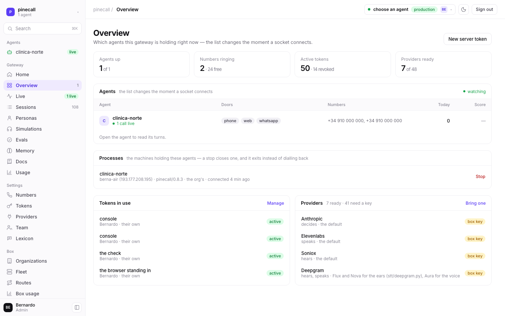
</picture>

La portada. **Qué agentes hay sostenidos en este momento**, con las puertas que cada uno declaró —
`phone · web · whatsapp` son las tres de Clínica Norte. Es la tabla viva del gateway y no el
registro: un agente que ningún proceso sostiene no contesta ninguna llamada, y por eso no está.

El interruptor `production | sandbox` de arriba cambia de mundo acuñando la key del otro para la
misma persona. Una key abre un mundo y sólo uno.

<picture>
  <source srcset="images/dark/live.png" media="(prefers-color-scheme: dark)">
  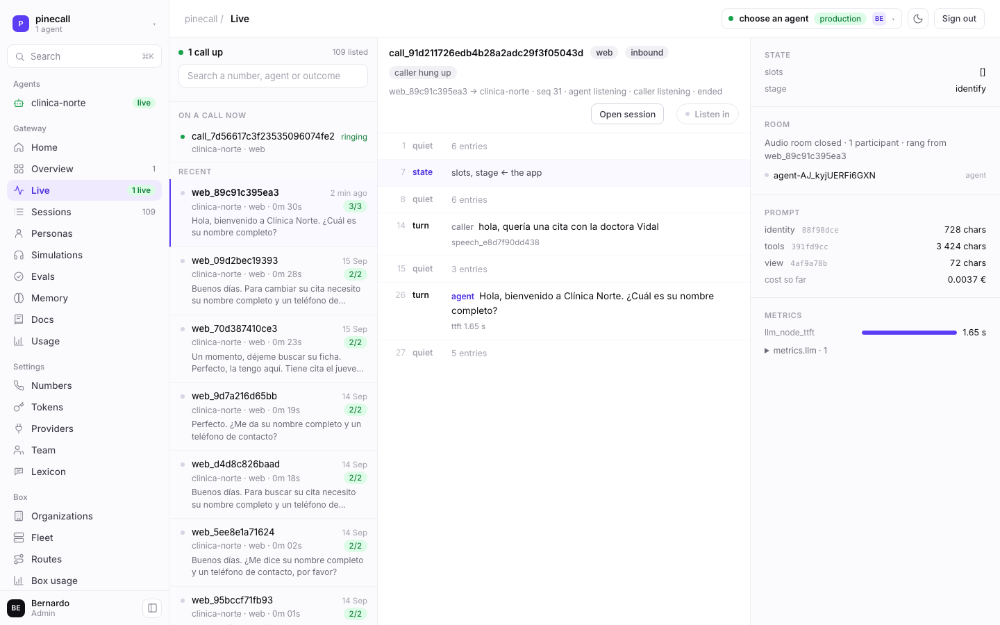
</picture>

**El suelo**: cada llamada que está abierta ahora mismo, del agente que sea. Llega por un stream,
así que se llena sola mientras mirás.

<picture>
  <source srcset="images/dark/sessions.png" media="(prefers-color-scheme: dark)">
  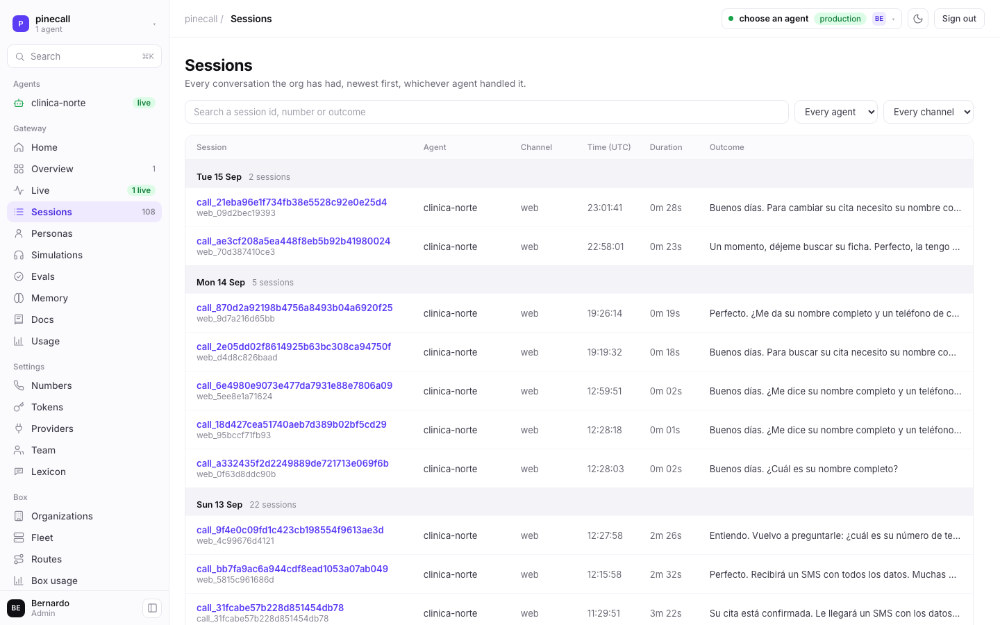
</picture>

**Las terminadas**, de toda la org, la más nueva arriba: cuándo, cuánto duró, de dónde vino y con
qué frase terminó. El id de cada una abre su log entero — el mismo que leen `pinecall sessions` y
la API, byte por byte.

## Un agente

Elegido uno en el selector de arriba, las pantallas pasan a ser suyas.

<picture>
  <source srcset="images/dark/talk.png" media="(prefers-color-scheme: dark)">
  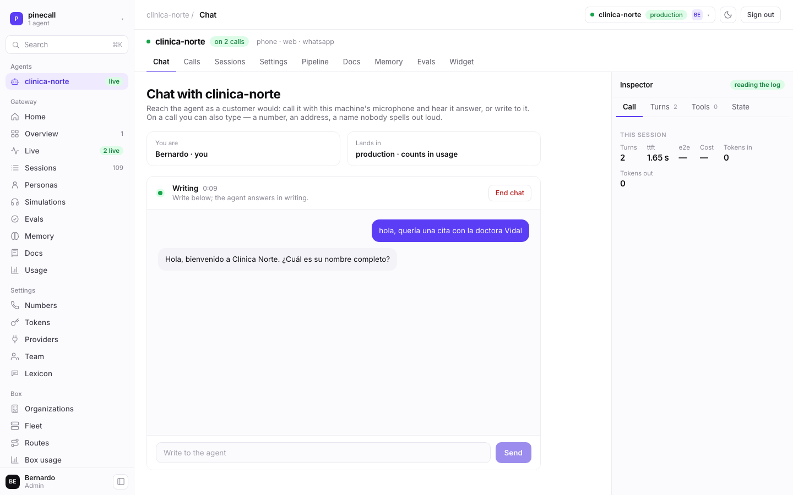
</picture>

**Talk**: hablarle desde el navegador, con micrófono, contra la misma sala de LiveKit que usaría un
teléfono. La consola pide un token de una llamada, no la key.

<picture>
  <source srcset="images/dark/chat.png" media="(prefers-color-scheme: dark)">
  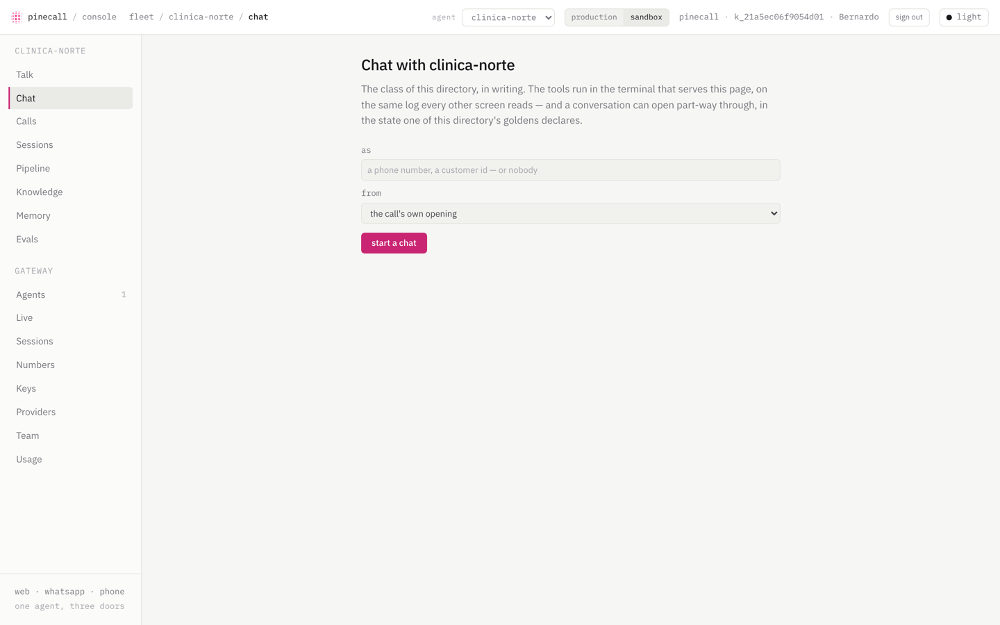
</picture>

**Chat**: la misma conversación escrita, con el log de esa llamada al lado. Lo que tipeás sale como
un turno; lo que vuelve es el log de la llamada, tal cual quedó escrito.

<picture>
  <source srcset="images/dark/calls.png" media="(prefers-color-scheme: dark)">
  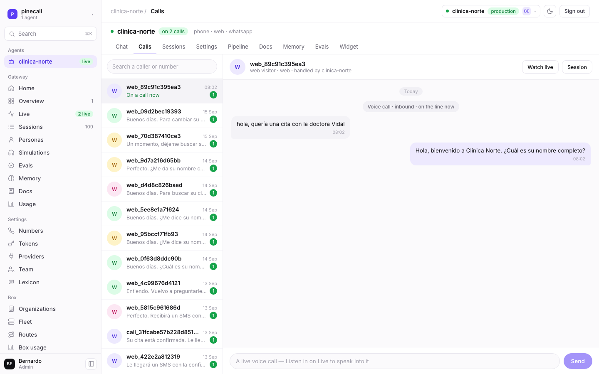
</picture>

**Calls**: las llamadas de este agente según van pasando, y una de ellas entera — los turnos, las
herramientas que corrió, las métricas de cada una.

<picture>
  <source srcset="images/dark/pipeline.png" media="(prefers-color-scheme: dark)">
  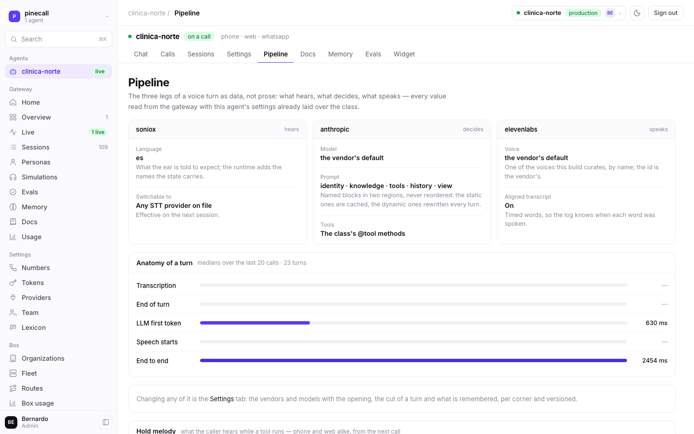
</picture>

**Pipeline**: qué oye, con qué decide y con qué habla, y las perillas encima. Cambiar una acá es lo
mismo que `pinecall pipeline set`: vale desde la próxima llamada, sin desplegar nada.

<picture>
  <source srcset="images/dark/knowledge.png" media="(prefers-color-scheme: dark)">
  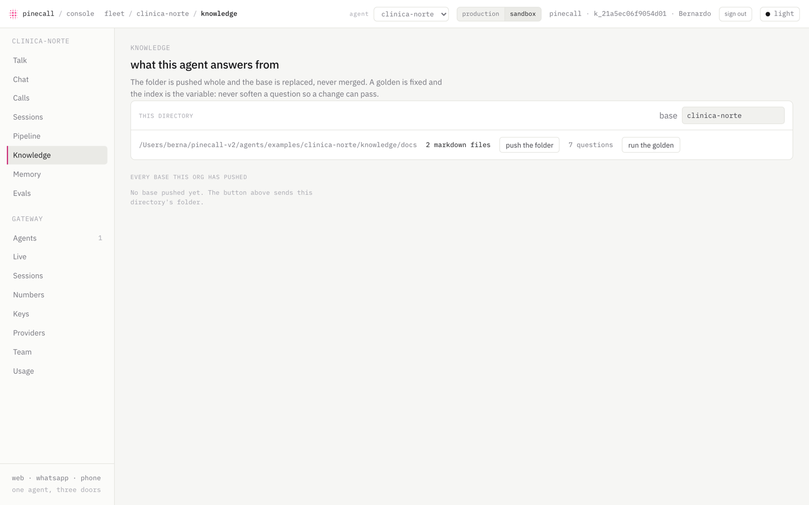
</picture>

**Knowledge**: la base de la que contesta, por trozos, con cuándo se subió. Es la del mundo de tu
key — un push con la key del sandbox no toca la que contesta el teléfono.

<picture>
  <source srcset="images/dark/memory.png" media="(prefers-color-scheme: dark)">
  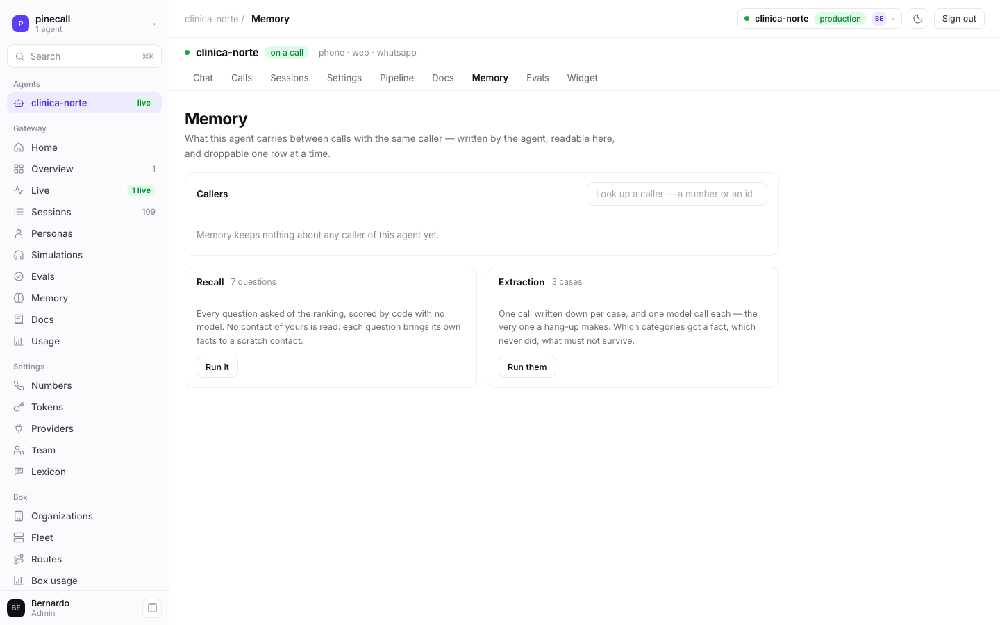
</picture>

**Memory**: lo que el agente aprendió de un contacto a lo largo de sus llamadas, y el botón para
olvidarlo. Los hechos son de una persona y de un mundo.

<picture>
  <source srcset="images/dark/evals.png" media="(prefers-color-scheme: dark)">
  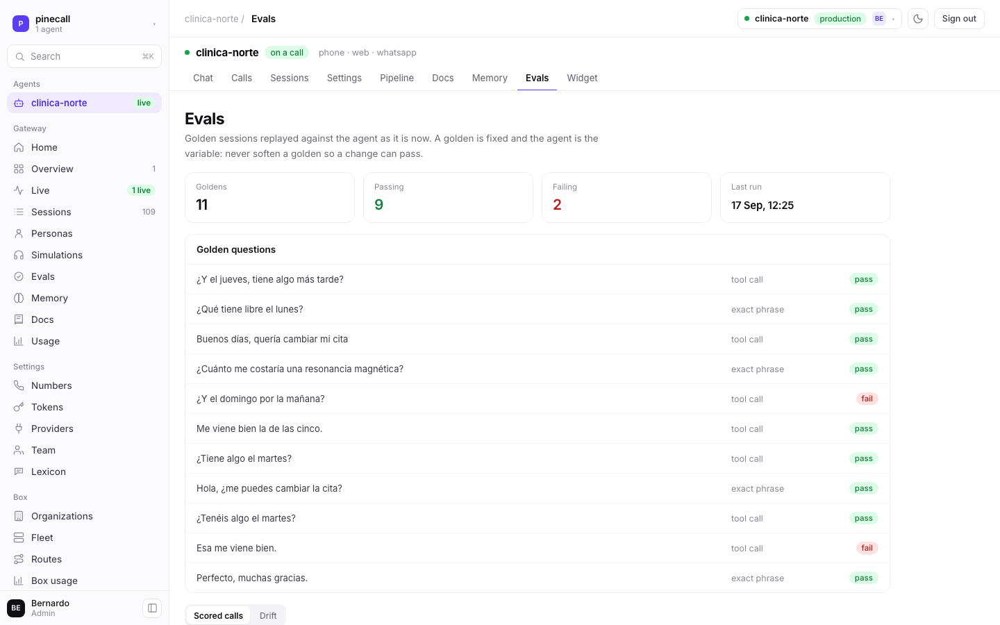
</picture>

**Evals**: los goldens y sus corridas. Correr una suite desde acá se la pide al proceso que sostiene
el agente — los goldens son archivos de su directorio, así que sólo ese proceso puede abrirla.

## Lo que es de la org y no de un agente

<picture>
  <source srcset="images/dark/numbers.png" media="(prefers-color-scheme: dark)">
  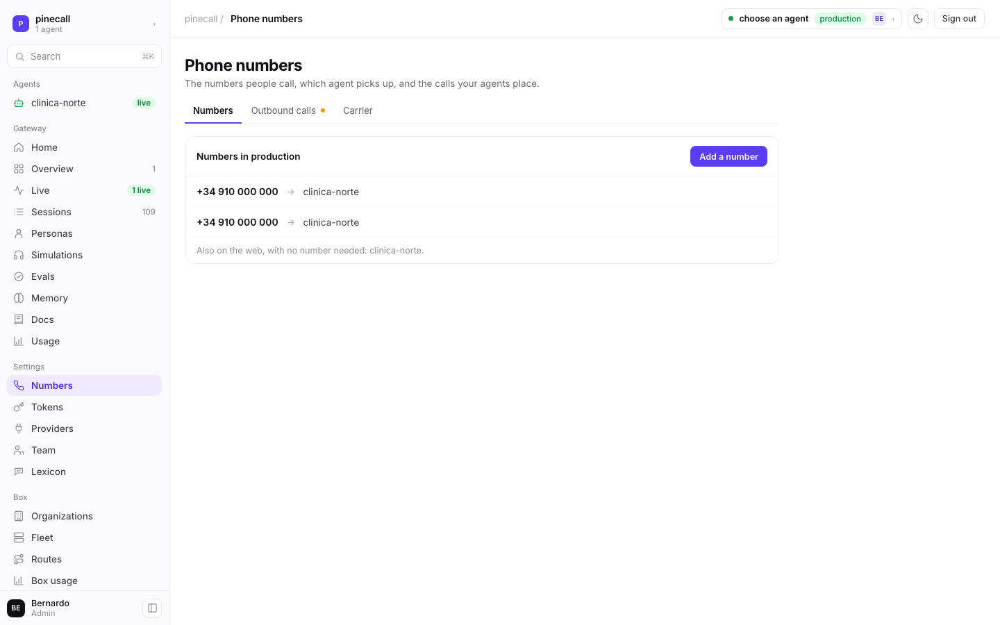
</picture>

**Numbers**: qué número llega a qué agente, y quién lo puso — un operador o la propia clase. Desde
acá se trae el carrier y se importa un número.

<picture>
  <source srcset="images/dark/keys.png" media="(prefers-color-scheme: dark)">
  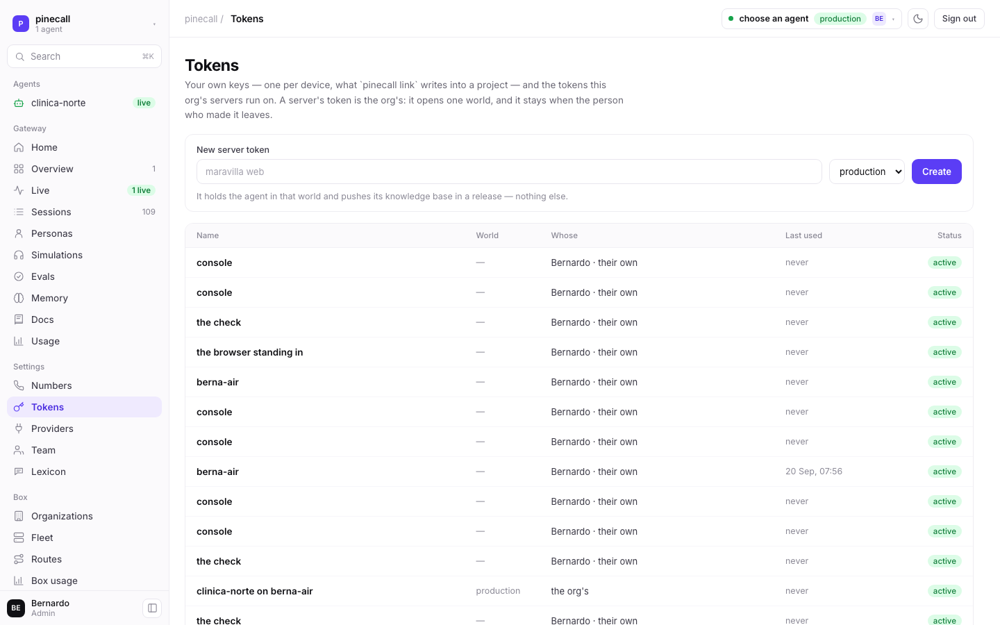
</picture>

**Keys**: las keys de la org por huella, nunca por valor. Qué mundo abre cada una, para qué es y de
quién: una key de persona lleva su nombre, una de máquina dice `a machine`. Revocar deja la fila,
así que las llamadas que esa key escribió se siguen leyendo.

<picture>
  <source srcset="images/dark/providers.png" media="(prefers-color-scheme: dark)">
  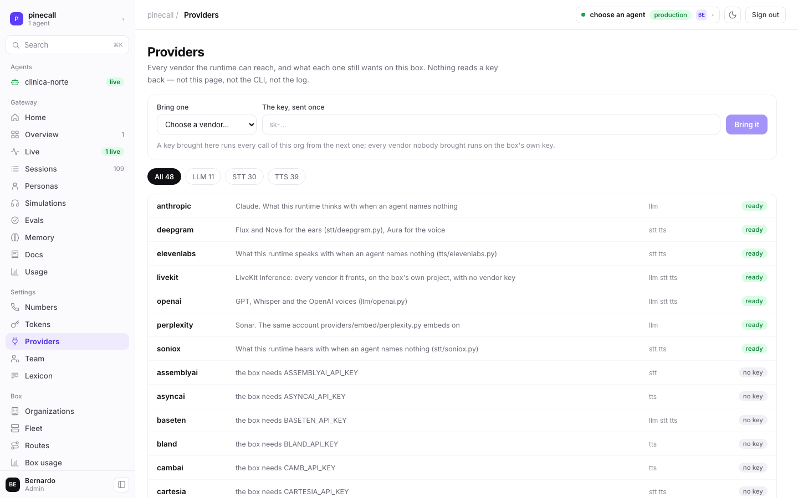
</picture>

**Providers**: cada vendor que esta build alcanza y cómo está — `ready`, `no key`, `no plugin`. Y
las que el tenant trajo propias, que viajan cifradas y no se leen de vuelta desde ninguna puerta.

<picture>
  <source srcset="images/dark/team.png" media="(prefers-color-scheme: dark)">
  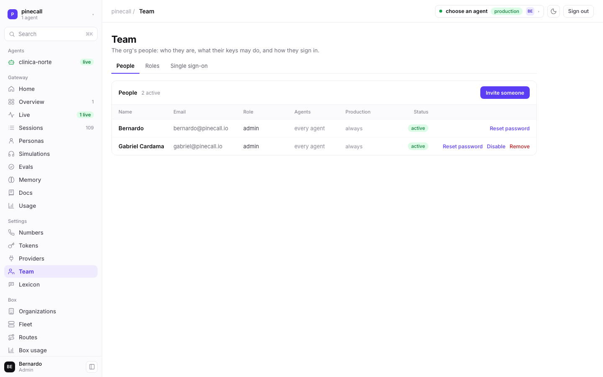
</picture>

**Team**: la gente de la org, su rol y su estado. Invitar imprime un link de un solo uso que abre la
pantalla de contraseña; el operador entrega el link y nunca una contraseña. Un rol es un preset de
scopes y nada más.

<picture>
  <source srcset="images/dark/usage.png" media="(prefers-color-scheme: dark)">
  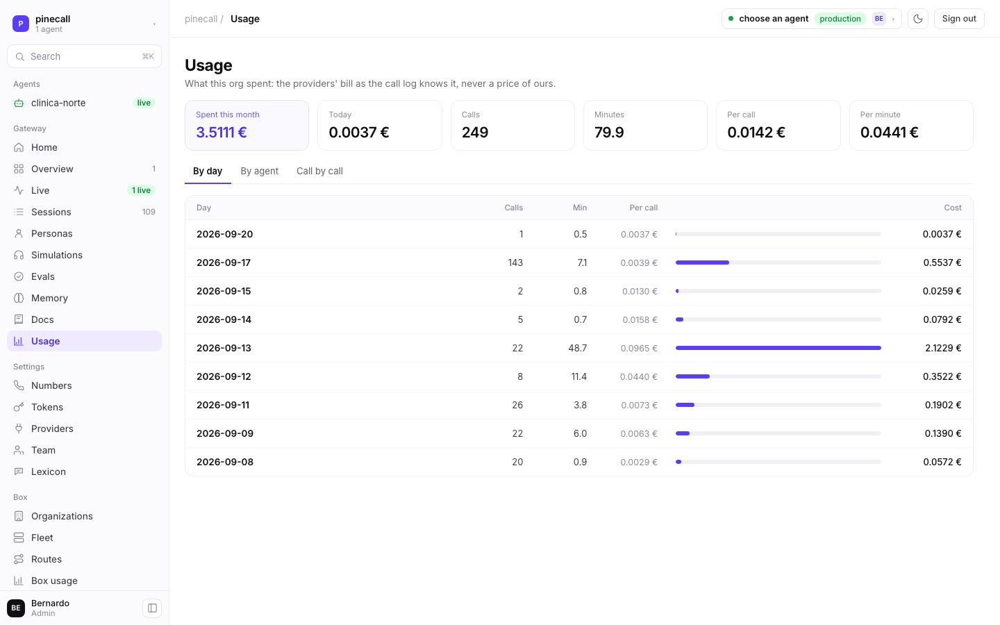
</picture>

**Usage**: lo que la org consumió, doblado del log según crece — minutos, mensajes, tokens, coste.
No hay contador que se desincronice: es una suma sobre lo que ya está escrito.

---

# El admin, que es del operador

Vive en `/admin`, toma **la ops key** y no la de ninguna persona. No hay `?login=` acá y no lo va a
haber: un código en una URL es cómo se le entrega una key a un navegador, y la de esta página abre
toda la box.

<picture>
  <source srcset="images/dark/admin-orgs.png" media="(prefers-color-scheme: dark)">
  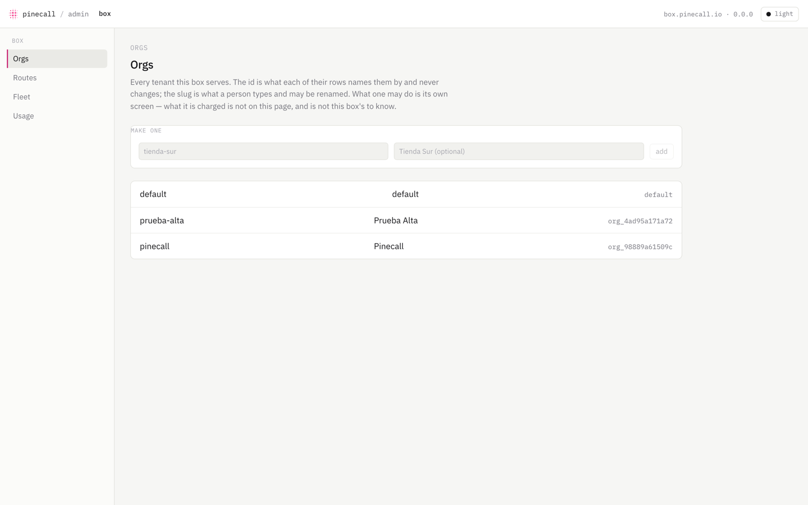
</picture>

**Orgs**: cada tenant que esta box sirve. El id es por el que lo nombran sus filas y no cambia; el
slug es lo que una persona escribe. Desde acá se crea uno.

<picture>
  <source srcset="images/dark/admin-routes.png" media="(prefers-color-scheme: dark)">
  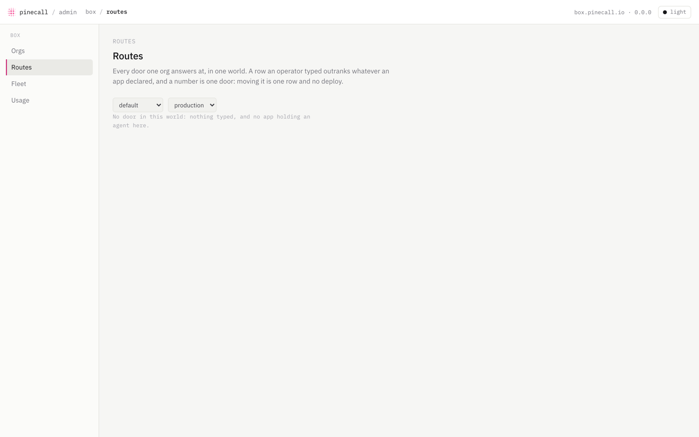
</picture>

**Routes**: los números desde el lado del operador — qué org, qué agente, qué mundo.

<picture>
  <source srcset="images/dark/admin-fleet.png" media="(prefers-color-scheme: dark)">
  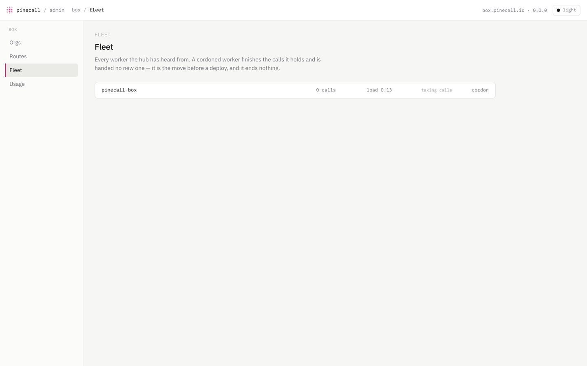
</picture>

**Fleet**: los workers que golpearon a este gateway, con cuántas llamadas aguanta cada uno y cuándo
latió por última vez. Desde acá se corta uno sin matarlo: deja de tomar llamadas nuevas y termina
las que tiene.

<picture>
  <source srcset="images/dark/admin-usage.png" media="(prefers-color-scheme: dark)">
  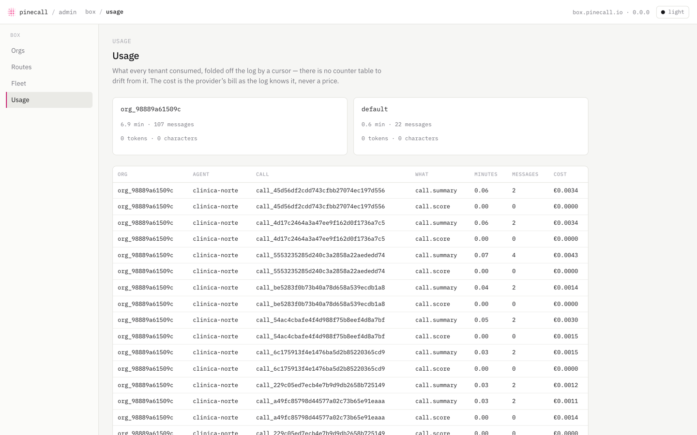
</picture>

**Usage**: el consumo de cada org, que es lo que se factura.

---

## What the box actually is

```
                 ┌─ caddy ────────── TLS, :80 :443, the only thing the internet reaches
internet ──────► │
                 └─ pinecall-gateway ── the API and the two pages, :8080 on loopback
                        │
                        ├── pinecall-postgres   the log, the orgs, the keys, the routes
                        ├── pinecall-livekit    the media plane, :7880 on loopback
                        ├── pinecall-sip        a telephone's way in
                        ├── pinecall-redis      a bus, not a store
                        └── pinecall-tei        what embeds, when it is this box's job
                 pinecall-worker ── answers a call with audio, dials the gateway by name
```

Every one is a systemd unit; the five containers are Quadlets. `infra/box/README.md` is the box
itself, credential by credential and unit by unit.

```bash
make status          # every unit and container, one line each
make logs UNIT=worker
make ssh
```

## When it does not come up

| you see | it means |
|---|---|
| `sed: can't read /etc/pinecall/box.env` | the box has no identity file. Three lines, §1 |
| `mkdir: cannot create directory '/opt/pinecall/app'` | it was deleted; the deploy remakes it now, older ones did not |
| `curl: (56) … 502` ten times, then `never answered` | the gateway did not start. `make logs` |
| `Error: parsing file ".../media.env"` | the box's own secrets are missing. `make deploy` starts `pinecall-secrets`; a reboot also does |
| `livekit — ConnectError: Connection refused` | the media plane is down. `make deploy` starts it; it never restarts one under a call |
| `✗ provider keys answer  ELEVEN_API_KEY refused (HTTP 401)` | a dead key, not a failed deploy. Rotate it, §5, then `make restart` |
| `no database: a key is verified against the api_keys table` | no `DATABASE_URL`, or the schema was never migrated |

**Nothing fixed by hand on a box counts.** A package goes in `PACKAGES`, a secret through
`make secret`, a class of failure into the doctor — and then the box re-converges through
`make deploy`. A box is a thing this repository can rebuild, or it is not a box.
