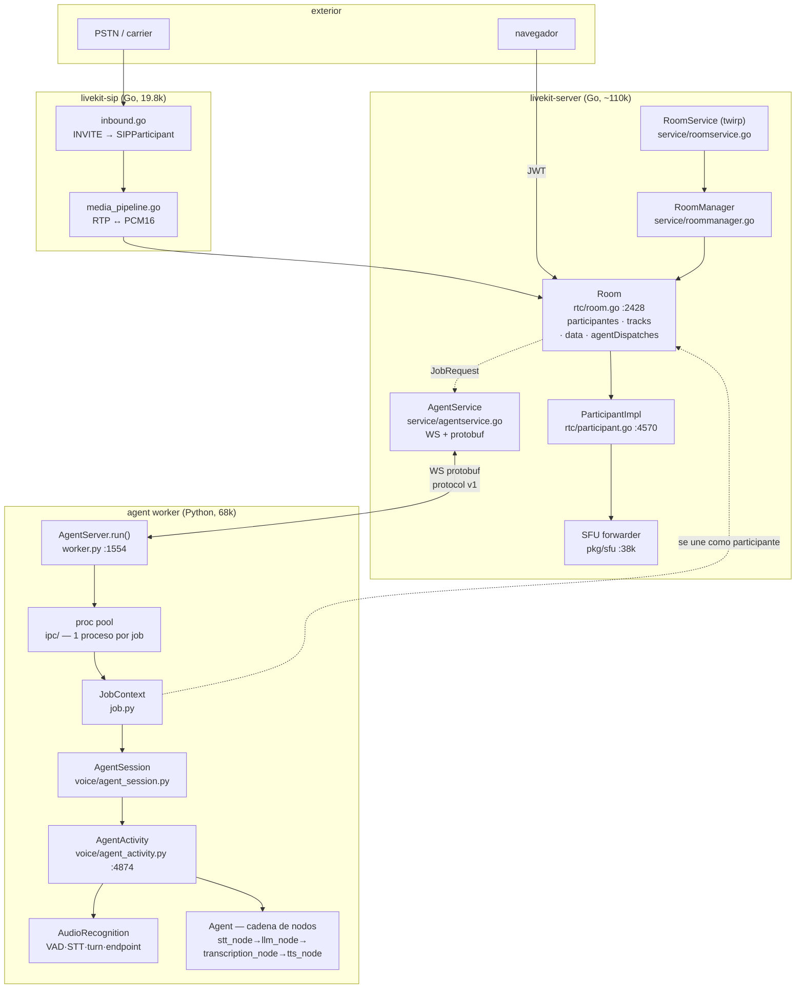
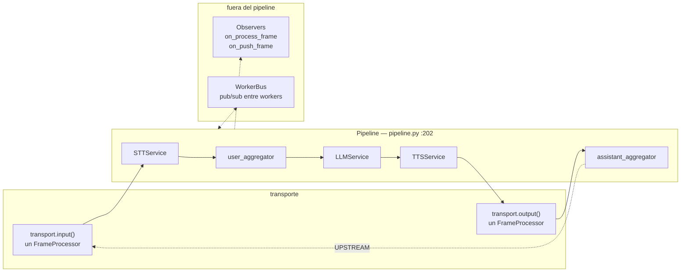
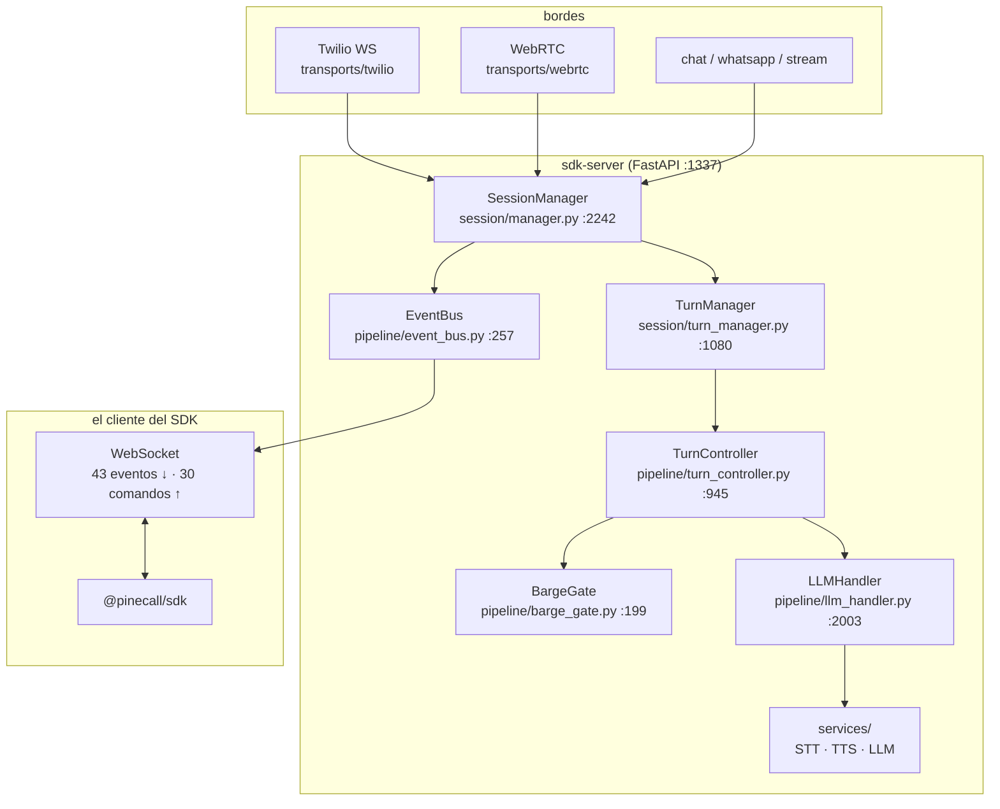
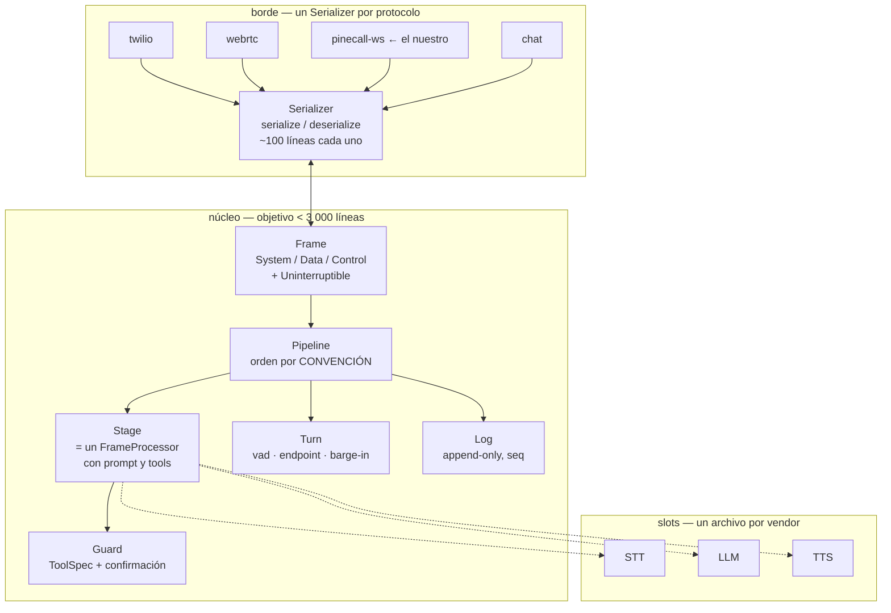

# Voice AI stack — mapa comparado y base para el rediseño de Pinecall

> Documento de trabajo para la evaluación de Fable. Todo lo que sigue está leído
> de código fuente en esta máquina, no de documentación ni de memoria. Cada
> afirmación lleva su archivo y, donde importa, su línea.
>
> Fecha: 2026-09-05 · Autor: sesión de exploración Opus 5

---

## 0. Inventario: qué se bajó y qué se leyó

| repo | ruta local | commit | qué es |
|---|---|---|---|
| `livekit/livekit` | `~/src/lk/livekit` | `e18fbcc` | el SFU en Go |
| `livekit/agents` | `~/src/lk/agents` | `d8607e6` (`livekit-agents@1.8.0`) | el runtime de agentes en Python |
| `livekit/sip` | `~/src/lk/sip` | `4bf92ed` | el puente SIP ↔ room |
| `livekit/protocol` | `~/src/lk/protocol` | `a4f4b5c` | los `.proto` compartidos |
| `pipecat-ai/pipecat` | `~/src/pipecat` | `833b382` | el framework de pipeline por frames |
| Pinecall (existente) | `~/pinecall/sdk-server`, `~/pinecall/sdk` | working tree | el servidor de voz y el protocolo WS |
| convo (prueba ABAI) | `~/prueba-abai` | `05c5fe4` | la plataforma multi-tenant sobre LiveKit |

**Nota de versión:** `~/prueba-abai` está fijado contra `livekit-agents 1.7.1`;
el clon nuevo es **1.8.0**. Las invariantes verificadas en ms-10 (el framework ya
protege `tool_use` huérfano en `group_tool_calls` / `remove_invalid_tool_calls`)
hay que re-verificarlas contra 1.8.0 antes de dar nada por bueno.

### Archivos leídos, y qué contiene cada uno

**LiveKit SFU (Go)**

| archivo | líneas | contenido |
|---|---|---|
| `pkg/rtc/room.go` | 2 428 | `Room`: el agregado central. Participantes, tracks, data packets, dispatch de agentes, cierre |
| `pkg/rtc/participant.go` | 4 570 | `ParticipantImpl`: permisos, publicación, suscripción, señalización |
| `pkg/service/agentservice.go` | 580 | el endpoint WS que registra workers y les reparte jobs |
| `pkg/agent/worker.go` | 604 | la máquina de estados de un worker y el handshake de asignación |
| `pkg/service/roommanager.go` | 1 246 | crea/destruye rooms, asigna nodo |
| `pkg/routing/` | 1 636 | `localrouter` / `redisrouter`: cómo se enruta señalización entre nodos |

**LiveKit Agents (Python)**

| archivo | líneas | contenido |
|---|---|---|
| `voice/agent_session.py` | 2 175 | `AgentSession`: el objeto que el usuario construye. ~45 parámetros en `__init__` |
| `voice/agent_activity.py` | **4 874** | el motor real: turnos, interrupciones, generación, tool steps |
| `voice/audio_recognition.py` | 1 963 | VAD + STT + turn detector + endpointing + backchannels |
| `voice/agent.py` | 1 101 | `Agent`: instrucciones, tools, y la **cadena de nodos** sobreescribibles |
| `voice/io.py` | 755 | `AudioInput` / `AudioOutput`: la costura que desacopla transporte de sesión |
| `voice/room_io/` | 2 164 | la implementación de esa costura contra un room de LiveKit |
| `worker.py` | 1 554 | el bucle WS contra el SFU: register, availability, assignment, termination |
| `job.py` | 1 033 | `JobContext`: room, api, shutdown callbacks, session report |
| `ipc/` | 3 106 | un proceso por job, supervisado |

Total `livekit-agents` (sin plugins): **68 120 líneas**. Plugins: ~90 paquetes.

**LiveKit SIP (Go)** — 19 801 líneas. `pkg/sip/inbound.go` (2 378) es el INVITE
entrante; `pkg/sip/room.go` (856) une la pata SIP con un room; `media_pipeline.go`
(499) es RTP ↔ PCM.

**Pipecat (Python)**

| archivo | líneas | contenido |
|---|---|---|
| `frames/frames.py` | 2 440 | **129 clases de frame** sobre 3 bases: `SystemFrame`, `DataFrame`, `ControlFrame` |
| `processors/frame_processor.py` | 1 333 | `FrameProcessor`: la unidad. `process_frame`, `push_frame`, `link`, métricas |
| `pipeline/pipeline.py` | 202 | encadena procesadores. **Ciento y pico de líneas: eso es todo** |
| `pipeline/worker.py` | 1 714 | `PipelineWorker`: el runnable de nivel superior |
| `transports/base_transport.py` | **~135** | el contrato entero de un transporte: `input()` y `output()` |
| `serializers/base_serializer.py` | 106 | el contrato entero de un serializador: `serialize()` / `deserialize()` |
| `serializers/twilio.py` | 314 | el protocolo WS de Twilio como un serializador |
| `flows/types.py` | 518 | `NodeConfig`: el nodo de una conversación como datos |
| `flows/manager.py` | 898 | el motor que mueve entre nodos |

**Pinecall hoy**

| área | líneas | contenido |
|---|---|---|
| `sdk-server/transports/` | 14 420 | twilio, webrtc, chat, stream, whatsapp, bridge, client |
| `sdk-server/services/` | 11 349 | STT/TTS/LLM |
| `sdk-server/session/` | 10 298 | `manager.py` (2 242), `turn_manager.py` (1 080), `config.py` (926) |
| `sdk-server/pipeline/` | 4 106 | `llm_handler.py` (2 003), `turn_controller.py` (945), `realtime_engine.py` (653), `event_bus.py` (257), `barge_gate.py` (199) |
| `sdk/src/protocol/` | 1 101 | **el protocolo WS: 43 eventos de servidor, ~30 comandos de cliente** |

---

## 1. LiveKit — la arquitectura

### 1.1 El grafo



### 1.2 Las entidades

| entidad | dónde vive | qué es |
|---|---|---|
| **Room** | `rtc/room.go` | el agregado. Nombre único, participantes, tracks, dispatches de agente. Se cierra solo cuando queda vacío (`CloseIfEmpty`) |
| **Participant** | `rtc/participant.go` | identidad + grants + transports (publisher/subscriber) + permisos. **Una conexión por identidad** — por eso escalar listen→takeover *actualiza* el participante en vez de sentar un segundo fantasma |
| **Track** | `rtc/mediatrack.go` | un flujo publicado; la suscripción es N:M vía `SubscriptionManager` |
| **Worker** | `pkg/agent/worker.go` | un proceso Python registrado por WS. Lleva `agentName`, `namespace`, `jobType`, `deployment`, `load` |
| **Job** | protobuf `livekit.Job` | la unidad de trabajo: `JT_ROOM`, `JT_PUBLISHER`, `JT_PARTICIPANT` |
| **AgentDispatch** | `rtc/room.go:884` | la petición de que un agente entre a un room. Puede venir en el JWT o por API |

### 1.3 El flujo de dispatch — leído línea a línea

Esto es lo que hay que entender de LiveKit, porque es lo que Pinecall **no
necesita** y paga igual:

```
1. Alguien crea un room (o llega un INVITE SIP y lo crea).
2. Room.AddAgentDispatch()  ──► rtc/room.go:884
3. AgentService.JobRequest(job)  ──► service/agentservice.go:~395
     key := workerKey{agentName, namespace, jobType, deployment}
     selected := h.selectWorkerWeightedByLoad(key, attempted)   ← balanceo por carga
4. Worker.AssignJob(ctx, job, hook)  ──► pkg/agent/worker.go:339
     ServerMessage{Availability: AvailabilityRequest{job}}  ──WS──►
5. El worker Python decide:
     AgentServer._answer_availability()  ──► worker.py:1351
       _refresh_worker_load(); if not available → available=false
       reserva un slot ANTES de correr request_fnc (evita carreras)
       on_accept → WorkerMessage{availability: {available, participant_identity, ...}}
6. El servidor acuña el token del agente:
     protoagent.BuildAgentToken(apiKey, apiSecret, room, identity, ..., permissions)
     ServerMessage{Assignment: JobAssignment{job, token}}  ──WS──►
7. El worker arranca UN PROCESO (ipc/) y ahí dentro:
     JobContext.connect() → se une al room con ese token
     AgentSession.start() → AgentActivity → AudioRecognition
8. Timeouts: RegisterTimeout 10s, AssignJobTimeout 10s (pkg/agent/worker.go:56)
```

**La observación que importa:** entre "llega una llamada" y "el LLM oye el primer
frame" hay **un SFU, un protocolo protobuf sobre WS, un balanceador de carga, un
handshake de disponibilidad de dos vueltas, un token acuñado, un proceso nuevo, y
una conexión WebRTC del worker de vuelta al mismo servidor**. Todo eso existe para
un problema que Pinecall no tiene: repartir jobs entre una flota heterogénea de
workers anónimos y multiplexar N participantes humanos en una sala.

### 1.4 La cadena de nodos — lo bueno de LiveKit

`voice/agent.py:355-470` define cuatro puntos de extensión, cada uno un
`AsyncIterable` in / `AsyncIterable` out:

```python
def stt_node(self, audio: AsyncIterable[rtc.AudioFrame], model_settings)
        -> AsyncIterable[stt.SpeechEvent | str]

def llm_node(self, chat_ctx, tools, model_settings)
        -> AsyncIterable[llm.ChatChunk | str | FlushSentinel]

def transcription_node(self, text: AsyncIterable[str | TimedString], model_settings)
        -> AsyncIterable[str | TimedString]

def tts_node(self, text: AsyncIterable[str], model_settings)
        -> AsyncIterable[rtc.AudioFrame]
```

Esto **es** la idea correcta y es la que `convo` explotó (`stt_gate` vive en
`TenantAgent.stt_node`). Es un pipeline, pero expresado como herencia en vez de
como composición.

### 1.5 La costura de I/O — la otra cosa buena

`voice/io.py` define `AudioInput` (un `AsyncIterator[rtc.AudioFrame]`) y
`AudioOutput` (con `capture_frame` / `flush` / `clear_buffer` + eventos de
playback). `voice/room_io/` es *una* implementación de eso contra un room.

**Consecuencia:** `AgentSession` en principio no depende de LiveKit. En la
práctica sí — `rtc.AudioFrame`, `rtc.Room`, `JobContext`, `RoomIO` están cosidos
por todos lados, y `agent_session.py` importa `livekit.rtc` directamente.

### 1.6 Dónde está la complejidad

```
voice/agent_activity.py     4 874 líneas   ← el 27% de voice/ en un archivo
voice/agent_session.py      2 175 líneas   ← ~45 parámetros en __init__
voice/audio_recognition.py  1 963 líneas
─────────────────────────────────────
voice/                     18 265 líneas
livekit-agents (total)     68 120 líneas
```

`AgentSession.__init__` acepta, entre otros: `stt`, `vad`, `llm`, `tts`,
`turn_handling`, `stt_context_options`, `tools`, `tool_handling`,
`max_tool_steps`, `use_tts_aligned_transcript`, `tts_text_transforms`,
`min_consecutive_speech_delay`, `expressive`, `userdata`, `video_sampler`,
`aec_warmup_duration`, `ivr_detection`, `user_away_timeout`,
`transcription_timeout`, `session_close_transcript_timeout`, `conn_options`,
más **catorce parámetros marcados `# deprecated`** que siguen ahí.

Ese es el síntoma: un objeto que acumula toda la configuración del sistema porque
no hay una unidad más pequeña donde ponerla.

---

## 2. Pipecat — la arquitectura

### 2.1 El grafo



### 2.2 Las entidades — cuatro, y se acabó

| entidad | archivo | contrato |
|---|---|---|
| **Frame** | `frames/frames.py:65` | un dataclass con `id`, `name`, `pts`, `metadata`, `transport_source/destination` |
| **FrameProcessor** | `processors/frame_processor.py:195` | `async process_frame(frame, direction)` + `push_frame()`. Se encadenan con `link()` |
| **Pipeline** | `pipeline/pipeline.py:91` | una lista de procesadores encadenados, con un `Source` y un `Sink` |
| **PipelineWorker** | `pipeline/worker.py` | el runnable: manda `StartFrame`, maneja errores, heartbeat |

Y dos contratos de borde, ambos minúsculos:

```python
# transports/base_transport.py — el transporte ENTERO
class BaseTransport(BaseObject):
    def input(self) -> FrameProcessor: ...
    def output(self) -> FrameProcessor: ...


# serializers/base_serializer.py — el serializador ENTERO
class FrameSerializer(BaseObject):
    async def serialize(self, frame: Frame) -> str | bytes | None: ...
    async def deserialize(self, data: str | bytes) -> Frame | None: ...
```

**Esto es lo que hay que robar.** Un transporte nuevo es dos `FrameProcessor`.
Un protocolo de cable nuevo son dos métodos. Twilio entero son 314 líneas
(`serializers/twilio.py`).

### 2.3 La taxonomía de frames — tres bases y un mixin

```python
# frames/frames.py:105-160
class SystemFrame(Frame):   # prioridad alta, NO se cancela por interrupción
class DataFrame(Frame):     # en orden, SÍ se cancela por interrupción
class ControlFrame(Frame):  # en orden, SÍ se cancela

class UninterruptibleFrame: # mixin: ordenado normal, pero sobrevive interrupciones
```

Esa distinción de tres estados es **la decisión de diseño más valiosa de todo
Pipecat**: la interrupción no es un caso especial dentro de cada componente, es
una propiedad del tipo del frame. Un `InterruptionFrame` (`:1146`) barre las colas
y las tareas de todo lo que sea `DataFrame`, y no toca los `SystemFrame`.

129 clases de frame es demasiado. Pero el **eje** es correcto.

### 2.4 El precio: verbosidad en el sitio de uso

El ejemplo canónico (`examples/getting-started/06-voice-agent.py`) tarda
**~130 líneas** en montar un agente que dice hola:

```python
stt = DeepgramSTTService(api_key=...)
tts = CartesiaTTSService(api_key=..., settings=CartesiaTTSService.Settings(voice="86e3..."))
llm = OpenAILLMService(api_key=..., settings=OpenAILLMService.Settings(system_instruction="..."))
context = LLMContext()
user_aggregator, assistant_aggregator = LLMContextAggregatorPair(
    context, user_params=LLMUserAggregatorParams(vad_analyzer=SileroVADAnalyzer()))
pipeline = Pipeline([
    transport.input(), stt, user_aggregator, llm, tts, transport.output(), assistant_aggregator,
])
worker = PipelineWorker(pipeline, params=PipelineParams(enable_metrics=True, ...),
                        idle_timeout_secs=..., processor_unusable_policy=ProcessorUnusablePolicy.END)
runner = WorkerRunner(handle_sigint=...)
await runner.add_workers(worker)
@transport.event_handler("on_client_connected")
async def on_client_connected(transport, client): ...
await runner.run()
```

**El usuario tiene que saber el orden del pipeline.** Tiene que saber que el
`user_aggregator` va después del STT y el `assistant_aggregator` después del
`transport.output()`. Tiene que instanciar un `LLMContextAggregatorPair`. Eso no
es Sinatra; eso es montar un Rack a mano cada vez.

**Ahí está el hueco que Pinecall puede ocupar.** El motor de Pipecat con el sitio
de uso de Rails: el orden por defecto es convención, no configuración.

### 2.5 Flows — la respuesta de Pipecat a los "stages"

`flows/types.py:182` — un nodo de conversación **como datos**:

```python
class NodeConfig(TypedDict, total=False):
    task_messages: Required[list[dict]]  # el objetivo de este nodo
    name: str
    role_message: str  # la personalidad; persiste entre nodos
    functions: list[FlowsFunctionSchema | FlowsDirectFunction]
    pre_actions: list[ActionConfig]  # antes de la inferencia
    post_actions: list[ActionConfig]  # después
    context_strategy: ContextStrategyConfig  # APPEND / RESET / RESET_WITH_SUMMARY
    respond_immediately: bool
```

Comparado con el `stage` de `convo` (un `TenantAgent` = una clase con su prompt y
sus tools, que devuelve el siguiente stage desde una tool): Pipecat lo tiene como
**configuración declarativa**, `convo` como **código**. El de `convo` es más
legible y testeable; el de Pipecat es más fácil de generar y de persistir.

`context_strategy` es lo que `convo` resolvió a mano en `TenantAgent.on_enter`
(escribir el `summary()` del stage anterior). Pipecat lo tiene nombrado.

---

## 3. Pinecall hoy

### 3.1 El grafo



### 3.2 El protocolo WS — el activo a conservar

`~/pinecall/sdk/src/protocol/` — **1 101 líneas**, y es el mejor activo de
Pinecall porque es lo único que un cliente ve.

**43 eventos de servidor** (`events.ts:415`), agrupables así:

| grupo | eventos |
|---|---|
| ciclo de llamada | `CallStarted`, `CallRinging`, `CallRejected`, `CallEnded`, `CallDialing`, `CallError`, `CallForwarded`, `SessionTimeout` |
| habla del usuario | `SpeechStarted`, `SpeechEnded`, `UserSpeaking`, `UserMessage` |
| turno | `EagerTurn`, `TurnPause`, `TurnEnd`, `TurnResumed`, `TurnContinued` |
| habla del bot | `BotSpeaking`, `BotWord`, `BotFinished`, `BotInterrupted`, `BargeIn` |
| control | `MessageConfirmed`, `ReplyRejected`, `CallHeld/Unheld`, `CallMuted/Unmuted` |
| DTMF | `CallDtmfSent`, `CallDtmfReceived` |
| tools | `ToolCall` (con `ToolCallItem`) |
| config | `ConfigUpdated`, `SessionConfigUpdated`, `PhoneAdded/Removed` |
| líneas | `LineCreated`, `LineError`, `LineDestroyed`, `CallRouted`, `CallRouteFailed` |
| infra | `Registered`, `Error`, `Pong`, `AgentDisplaced`, `AudioMetrics` |

**~30 comandos de cliente** (`commands.ts:248`): `Register`, `BotReply`,
`BotReplyStream`, `BotCancel`, `BotClear`, `CallHangup`, `CallDial`,
`CallForward`, `CallDtmf`, `UpdateConfig`, `UpdateSessionConfig`,
`AddPhone`/`RemovePhone`, `CallHold/Unhold/Mute/Unmute`, `Ping`, `Connect`,
`AgentCreate`/`Resume`/`Configure`, `ChannelAdd`/`Configure`/`Remove`,
`SessionConfigure`, `LineCreate`/`Destroy`, `CallRoute`.

Frontera de nombres: **snake_case en el cable, camelCase en el SDK**, y
`codec.ts` (40 líneas) es el único sitio que toca nombres de clave.

> **Esto ya es una taxonomía de frames.** `BotWord` es `TTSTextFrame`.
> `SpeechStarted`/`SpeechEnded` son `UserStartedSpeakingFrame`/`UserStopped…`.
> `BargeIn` es `InterruptionFrame`. `TurnPause`/`TurnEnd` son el
> `UserTurnController` de Pipecat. La diferencia es que en Pinecall estos son
> **eventos de salida hacia un cliente**, y en Pipecat son **la moneda interna
> del pipeline**. Unificar las dos cosas es la idea central del rediseño.

### 3.3 Dónde duele hoy

```
session/manager.py      2 242 líneas
pipeline/llm_handler.py 2 003 líneas
session/turn_manager.py 1 080 líneas
pipeline/turn_controller.py 945
```

Cuatro archivos, 6 270 líneas, y el control de turno está repartido entre
`session/turn_manager.py` y `pipeline/turn_controller.py` — dos módulos con el
mismo sustantivo en dos paquetes distintos. Ese es exactamente el síntoma que
`convo/ms-23` diagnosticó y curó en su propio árbol: crecimiento por acreción sin
una unidad de composición.

---

## 4. La comparación, en una tabla

| dimensión | LiveKit Agents | Pipecat | Pinecall hoy |
|---|---|---|---|
| **unidad de composición** | `Agent` (herencia: sobreescribís `*_node`) | `FrameProcessor` (composición: encadenás) | ninguna explícita — handlers en un manager |
| **moneda interna** | streams tipados por nodo | `Frame` (129 clases, 3 bases) | eventos del EventBus + llamadas directas |
| **transporte** | acoplado a un room de LiveKit (`RoomIO`, 2 164 líneas) | `input()` + `output()`: dos métodos | un paquete por transporte, 14.4k líneas |
| **protocolo de cable** | protobuf sobre WS, propio | `serialize`/`deserialize`, 2 métodos | WS propio: 43 eventos + 30 comandos |
| **interrupción** | lógica dentro de `agent_activity.py` | **una propiedad del tipo de frame** | `BargeGate` + `TurnController` |
| **conversación por fases** | subclases de `Agent` + `hand_off` | `NodeConfig` declarativo (flows) | config de sesión |
| **infra que exige** | SFU + redis + SIP bridge + worker pool | **ninguna** — un proceso | FastAPI + Twilio/WebRTC |
| **coste de "hola mundo"** | worker + dispatch + token + room | ~130 líneas explícitas | un agente del SDK |
| **núcleo (líneas)** | 68 120 | ~11 000 sin services | ~29 000 sin services |
| **licencia** | Apache 2.0 | BSD 2-Clause | privado |

### El veredicto

- **LiveKit** resuelve *multiplexación de medios entre humanos*. Un agente de voz
  1:1 paga todo el SFU para no usarlo. La cadena de nodos y la costura de I/O son
  lo bueno; el resto es peaje.
- **Pipecat** resuelve *composición de un pipeline de tiempo real*. El núcleo es
  correcto y minúsculo (`Pipeline` son 202 líneas). El pecado es que el sitio de
  uso es explícito: el usuario monta el Rack.
- **Pinecall** ya tiene *la superficie que un cliente ve* (el protocolo WS) y le
  falta la unidad de composición por dentro.

---

## 5. La propuesta: Sinatra/Rails para voz

### 5.1 La tesis

> **Pipecat tiene el motor correcto y el sitio de uso equivocado. LiveKit tiene
> la extensibilidad correcta y la infraestructura equivocada. Pinecall tiene el
> protocolo correcto y ninguna unidad de composición.**
>
> La versión nueva toma: el `Frame` de Pipecat como moneda, el `*_node` de
> LiveKit como punto de extensión, el protocolo WS de Pinecall como superficie —
> y añade lo que ninguno de los tres tiene: **una convención de pipeline por
> defecto, para que el caso común no se escriba.**

Sinatra: `get '/' do ... end`. El equivalente en voz:

```python
from pinecall import agent


@agent(voice="carolina", stt="soniox", llm="haiku")
async def receptionist(turn):
    return f"Hola, soy la recepción. ¿En qué le ayudo?"
```

Rails: cuando el caso deja de ser común, se abre por capas — sin reescribir.

### 5.2 El grafo objetivo



### 5.3 Las decisiones que propongo, con su porqué

**1. El `Frame` es también el evento del cable.**
Hoy Pinecall tiene 43 eventos de salida y por dentro llamadas directas. Si el
frame interno **es** el evento, el protocolo WS deja de ser una capa de traducción
y pasa a ser una proyección: `serialize(frame)` con un filtro. El protocolo se
conserva byte a byte y desaparece el código que lo produce a mano.
*Riesgo:* no todo frame interno debe salir. Se resuelve con un flag declarado en
el frame (`public: bool`), no con una lista en el serializador.

**2. Tres bases de frame, no 129 clases.**
`SystemFrame` / `DataFrame` / `ControlFrame` + el mixin `Uninterruptible` es el
eje de Pipecat y es correcto. Las 129 clases son el error. Un `DataFrame` con un
campo `kind: str` dotado (como los `kinds` dotados del event log de `convo`:
`turn.agent`, `tool.call`) da lo mismo y se greppea sin importar nada.

**3. Un `Stage` es un `FrameProcessor` con prompt y tools.**
Es la fusión: la clase de LiveKit (legible, testeable) sobre el contrato de
Pipecat (componible). `convo` ya probó que el stage es la abstracción correcta
para una conversación de negocio, y ms-18 probó por qué un stage nuevo gana a una
rama dentro de otro (el contrato de cada stage se mantiene decible).

**4. El orden del pipeline es convención.**
El pecado de Pipecat es que el usuario escribe
`[input, stt, user_agg, llm, tts, output, assistant_agg]`. La versión nueva monta
ese orden sola y sólo pide lo que lo cambia. `Pipeline.default(stage)` construye
la cadena; `Pipeline([...])` sigue existiendo para quien la necesite.

**5. Cero infraestructura obligatoria.**
Un proceso. Sin SFU, sin redis, sin cola. WebRTC 1:1 con `aiortc` o con el
`smallwebrtc` de Pipecat; SIP con un serializador de Twilio de 300 líneas. El día
que haga falta multiplexar humanos en una sala, ahí sí se mete un SFU — y esa es
la condición escrita, no una decisión de arranque.

**6. Lo que se trae de `convo` sin discusión.**
Estas cuatro cosas están construidas, medidas y pagadas en `~/prueba-abai`, y son
lo que ningún framework de voz open source tiene:
- **`ToolSpec` + guard + token de confirmación** — lo irreversible exige un "sí"
  real, ligado a `sha(tool + args)`, de un solo uso.
- **El log append-only con `seq`, SIGKILL-safe**, con PII enmascarada por
  declaración *y* por valor.
- **Los cuatro anillos de evaluación**, con las políticas duras como DAGs
  deterministas y no como GEval.
- **El reloj como par tool-call + tool-result**, nunca como system message.

**7. La licencia.**
Apache 2.0 (como LiveKit) y no BSD-2 (Pipecat): la cláusula de patentes es lo que
un cliente corporativo mira. El modelo es: **el framework gratis y para todos, la
consultoría es el negocio** — que es exactamente el modelo con el que Pipecat
(Daily) y LiveKit compiten, salvo que ellos cobran cloud y vos cobrás criterio.

### 5.4 El presupuesto de líneas

| pieza | objetivo | referencia |
|---|---|---|
| `frames.py` | 250 | pipecat: 2 440 |
| `processor.py` | 300 | pipecat: 1 333 |
| `pipeline.py` | 200 | pipecat: 202 ✔ |
| `turn.py` (vad+endpoint+barge) | 400 | livekit: 1 963 |
| `stage.py` | 250 | livekit `agent.py`: 1 101 |
| `guard.py` + `tools.py` | 300 | convo: ya existe |
| `log.py` | 200 | convo: ya existe |
| serializador por protocolo | ~150 c/u | pipecat twilio: 314 |
| slot por vendor | ~120 c/u | — |
| **núcleo** | **< 2 500** | livekit-agents: 68 120 |

Regla de `convo` que se conserva: **ningún archivo por encima de 400 líneas**, un
docstring de una línea, el porqué en `docs/decisions/<módulo>.md`.

---

## 6. Lo que Fable debería verificar

Preguntas abiertas donde yo no tengo evidencia suficiente y una evaluación fría
vale más que mi juicio:

1. **¿El `Frame` como evento de cable aguanta?** Los 43 eventos de Pinecall
   incluyen cosas de plano de control (`LineCreated`, `PhoneAdded`,
   `ConfigUpdated`) que no son frames de una conversación. ¿Dos monedas, o una
   con un flag?
2. **¿WebRTC sin SFU es viable en producción?** LiveKit resuelve NAT, TURN,
   simulcast y reconexión. `aiortc` / `smallwebrtc` no traen eso gratis. El coste
   real de salir del SFU está sin medir.
3. **¿El presupuesto de 2 500 líneas es honesto?** Las 4 874 líneas de
   `agent_activity.py` no son gratuitas: son interrupciones, tool steps,
   preemptive generation, false interruptions, backchannels. ¿Cuánto de eso es
   accidente y cuánto es el dominio?
4. **¿Herencia (LiveKit) o composición (Pipecat) para el `Stage`?** Yo propongo
   la fusión, pero puede ser lo peor de las dos.
5. **La migración.** `sdk-server` son 29 000 líneas en producción con clientes
   vivos (Clara/Oximesa, Nova/Naffco, Portia). El protocolo WS se conserva, pero
   ¿el nuevo motor entra por detrás con el protocolo intacto, o es un producto
   aparte que convive?

---

## 7. Comandos para reproducir esta lectura

```bash
# los clones
ls ~/src/lk/{livekit,agents,sip,protocol} ~/src/pipecat

# el dispatch de LiveKit, de punta a punta
nvim -p ~/src/lk/livekit/pkg/service/agentservice.go \
        ~/src/lk/livekit/pkg/agent/worker.go \
        ~/src/lk/agents/livekit-agents/livekit/agents/worker.py

# la cadena de nodos y la costura de I/O
nvim -p ~/src/lk/agents/livekit-agents/livekit/agents/voice/agent.py \
        ~/src/lk/agents/livekit-agents/livekit/agents/voice/io.py

# el núcleo de pipecat — lo que hay que robar
nvim -p ~/src/pipecat/src/pipecat/pipeline/pipeline.py \
        ~/src/pipecat/src/pipecat/transports/base_transport.py \
        ~/src/pipecat/src/pipecat/serializers/base_serializer.py \
        ~/src/pipecat/src/pipecat/frames/frames.py \
        ~/src/pipecat/examples/getting-started/06-voice-agent.py

# el protocolo que se conserva
nvim -p ~/pinecall/sdk/src/protocol/events.ts \
        ~/pinecall/sdk/src/protocol/commands.ts \
        ~/pinecall/sdk/src/protocol/codec.ts

# lo que se trae de convo
nvim -p ~/prueba-abai/convo/tools/guard.py \
        ~/prueba-abai/convo/state/log.py \
        ~/prueba-abai/convo/agents/stage.py
```
